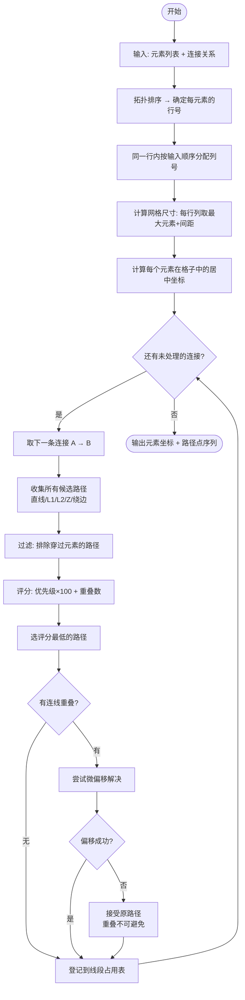
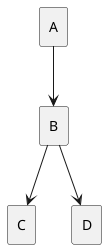

# 流程图自动布局与正交连线算法

## 概述

本文档描述了一个用于自动绘制流程图的算法，核心解决两个问题：
1. **自动布局**：将元素放置在网格中，自动计算位置
2. **正交连线**：在元素之间绘制水平+垂直的折线，避免与元素重叠，最小化转折点

---

## 一、整体架构

```
┌──────────────────────────────────────────────────────────┐
│                    输入处理阶段                            │
│  元素列表（名称+形状+尺寸） + 连接关系（source→target）    │
└──────────────────────┬───────────────────────────────────┘
                       ↓
┌──────────────────────────────────────────────────────────┐
│                    布局阶段（Phase 1）                     │
│  1. 拓扑排序 → 确定元素的行列位置                          │
│  2. 计算网格尺寸 → 确定每个格子的大小                      │
│  3. 元素居中放置 → 计算每个元素的绝对坐标                  │
└──────────────────────┬───────────────────────────────────┘
                       ↓
┌──────────────────────────────────────────────────────────┐
│                    连线阶段（Phase 2）                     │
│  1. 分类相对位置场景                                      │
│  2. 选择连接点                                            │
│  3. 检查障碍物（元素 + 已放置连线）                        │
│  4. 选择路径（直线/L型/Z型）                              │
│  5. 连线重叠解决（偏移/切换方案）                          │
│  6. 生成路径点序列 + 箭头                                 │
└──────────────────────┬───────────────────────────────────┘
                       ↓
┌──────────────────────────────────────────────────────────┐
│                       输出                                │
│  元素坐标 + 连接路径点序列                                 │
└──────────────────────────────────────────────────────────┘
```

---

## 二、布局阶段（Phase 1）

### 2.1 拓扑排序

**输入**：连接关系图 G = (V, E)，其中 V 是元素集合，E 是连接集合

**算法**：Kahn 算法

```
function TopologicalSort(V, E):
    inDegree[v] = 0 for each v in V
    for each (u → v) in E:
        inDegree[v]++
    
    queue = {v | inDegree[v] == 0}
    level[v] = 0 for each v in queue
    
    while queue not empty:
        u = queue.dequeue()
        for each (u → v) in E:
            inDegree[v]--
            if inDegree[v] == 0:
                level[v] = level[u] + 1
                queue.enqueue(v)
    
    return level  // 每个元素的层级（行号）
```

**说明**：拓扑排序的结果决定了元素的**行号**。若同一层中有多个元素，按其在原始输入中的顺序从左到右排列。

### 2.2 列分配

在同一行中，如果有多个元素，按照它们在输入中出现的顺序从左到右分配列号。

> **特殊情况处理**：如果拓扑排序后所有元素都在同一行，则按输入顺序依次排列。如果有分支结构（如 A → B, A → C），B 和 C 在同一行，依据输入顺序排列。

### 2.3 网格尺寸计算

每个格子的大小由同行/同列中最大的元素决定：

```
function GridCellSize(elements, rows, cols):
    for each row r:
        max_h[r] = max(elements[r][c].height for all c in row r)
    for each col c:
        max_w[c] = max(elements[r][c].width for all r in col c)
    
    // 添加间距 padding
    padding_x = 40  // 水平间距
    padding_y = 60  // 垂直间距
    
    cell_w[c] = max_w[c] + padding_x
    cell_h[r] = max_h[r] + padding_y
    
    return cell_w, cell_h
```

### 2.4 元素绝对坐标计算

```
function ElementPosition(element, row, col, cell_w, cell_h):
    // 格子左上角
    grid_x = sum(cell_w[0..col-1])
    grid_y = sum(cell_h[0..row-1])
    
    // 元素在格子中居中
    elem_x = grid_x + (cell_w[col] - element.width) / 2
    elem_y = grid_y + (cell_h[row] - element.height) / 2
    
    return (elem_x, elem_y)
```

**边界偏移**（用于连接点计算）：
- 对于圆角矩形/圆形：连接点偏移量与矩形相同（从外边缘算起）
- 对于菱形：连接点位于菱形的四个顶点

---

## 三、坐标系与连接点定义

### 3.1 元素属性

对于元素 E，定义：
- `(x, y)`：元素左上角坐标
- `w, h`：元素宽度和高度
- `cx = x + w/2`：元素中心 x
- `cy = y + h/2`：元素中心 y

### 3.2 十二个连接点

每条边 3 个连接点，共 12 个，提供更精细的出口/入口选择。

```
// 水平方向三等分点（用于上边和下边）
stepX = w / 4   // 从中心到左右三等分点的 x 偏移

// 垂直方向三等分点（用于左边和右边）
stepY = h / 4   // 从中心到上下三等分点的 y 偏移

// 上边（3 个点）
Top-Left    (T-L):  (cx - stepX, y)
Top-Center  (T-C):  (cx, y)
Top-Right   (T-R):  (cx + stepX, y)

// 下边（3 个点）
Bottom-Left (B-L):  (cx - stepX, y + h)
Bottom-Center (B-C):(cx, y + h)
Bottom-Right  (B-R):(cx + stepX, y + h)

// 左边（3 个点）
Left-Top    (L-T):  (x, cy - stepY)
Left-Center (L-C):  (x, cy)
Left-Bottom (L-B):  (x, cy + stepY)

// 右边（3 个点）
Right-Top   (R-T):  (x + w, cy - stepY)
Right-Center (R-C): (x + w, cy)
Right-Bottom  (R-B):(x + w, cy + stepY)
```

**命名规则**：`<方位>-<子位置>`，方位用 T/B/L/R，子位置用 L/C/R 或 T/C/B。

**图示**：

```
      T-L      T-C      T-R
       ┌─────────────────┐
  L-T  │                 │  R-T
  L-C  │     元素中心     │  R-C
  L-B  │                 │  R-B
       └─────────────────┘
      B-L      B-C      B-R
```

### 3.3 形状适配

| 形状 | 连接点处理 |
|------|-----------|
| 矩形 / 圆角矩形 | 12 个连接点按三等分定义如上 |
| 圆形 / 椭圆 | 12 个连接点均匀分布在圆周上，对应角度：T=90°, L=180°, B=270°, R=0°，子点按比例分布 |
| 菱形 | 每个边三等分后投射到菱形边上（菱形每条边的三等分点） |

---

### 3.4 连接点选择策略

路由时，在 12 个点中选最优的出口/入口组合。选择规则按优先级排列：

```
function SelectConnectionPoints(A, B, scenario, placedLines):
    // 1. 确定目标方位（从 A 看 B 在哪个方向）
    exitSide = DetermineExitSide(A, B)    // 返回 T/B/L/R
    entrySide = DetermineEntrySide(A, B)  // 返回 T/B/L/R
    
    // 2. 在目标边上选择子点
    //    原则：子点位置应与路径方向匹配，使路径最短
    
    if exitSide == "R":
        if B.cy > A.cy + A.h/4:  // B 偏下
            exitSub = "B"        // A.R-B
        elif B.cy < A.cy - A.h/4: // B 偏上
            exitSub = "T"        // A.R-T
        else:
            exitSub = "C"        // A.R-C
    
    if exitSide == "B":
        if B.cx > A.cx + A.w/4:  // B 偏右
            exitSub = "R"        // A.B-R
        elif B.cx < A.cx - A.w/4: // B 偏左
            exitSub = "L"        // A.B-L
        else:
            exitSub = "C"        // A.B-C
    
    // 目标侧同理...
    
    // 3. 备选方案：如果默认识别的点被其他连线占据或路径不佳，
    //    尝试同边的其他子点
    candidateExits = GenerateCandidates(exitSide)  // 如 [R-C, R-B, R-T]
    return BestMatch(candidateExits, entryCandidates, placedLines)
```

**默认规则**：无特殊情况下，所有场景优先使用**中心子点**（T-C, B-C, L-C, R-C），与 4 点系统行为一致。边缘子点在有重叠或障碍时启用。

---

## 四、连线阶段（Phase 2）—— 场景枚举

### 4.1 相对位置场景分类

对于源元素 A 和目标元素 B，根据它们在网格中的行列关系分类：

```
scenario = Classify(A, B)

if A.row == B.row:
    if A.col < B.col:  →  "同排_右"
    else:              →  "同排_左"
elif A.col == B.col:
    if A.row < B.row:  →  "同列_下"
    else:              →  "同列_上"
elif A.row < B.row:
    if A.col < B.col:  →  "右下"
    else:              →  "左下"
else:  // A.row > B.row
    if A.col < B.col:  →  "右上"
    else:              →  "左上"
```

### 4.2 各场景连接点选择与路径模式

> **注意**：以下所有场景中，默认使用各边的**中心子点**（即 T-C, B-C, L-C, R-C），与 4 点系统行为一致。
> 当需要避免重叠或绕行时，可切换到同边的其他子点（如 R-B 代替 R-C）。

#### 场景 1：同列_下（B 在 A 正下方）

```
A.row < B.row, A.col == B.col

默认连接点: A.B-C → B.T-C
路径:       直线
转折点:     0

可选子点:   A.B-C + B.T-C (默认)
            A.B-L + B.T-L (偏左)
            A.B-R + B.T-R (偏右)

示意图:
  ┌───┐
  │ A │
  └─┬─┘
    │ ← 垂直直线
  ┌─┴─┐
  │ B │
  └───┘
```

#### 场景 2：同列_上（B 在 A 正上方）

```
A.row > B.row, A.col == B.col

默认连接点: A.T-C → B.B-C
路径:       直线
转折点:     0

示意图:
  ┌───┐
  │ B │
  └─┬─┘
    │
  ┌─┴─┐
  │ A │
  └───┘
```

#### 场景 3：同排_右（B 在 A 正右方）

```
A.row == B.row, A.col < B.col

默认连接点: A.R-C → B.L-C
路径:       直线
转折点:     0

示意图:
  ┌───┐       ┌───┐
  │ A │──────→│ B │
  └───┘       └───┘
```

#### 场景 4：同排_左（B 在 A 正左方）

```
A.row == B.row, A.col > B.col

默认连接点: A.L-C → B.R-C
路径:       直线
转折点:     0

示意图:
  ┌───┐       ┌───┐
  │ B │←──────│ A │
  └───┘       └───┘
```

---

#### 场景 5：右下（B 在 A 的右下方）

```
A.row < B.row, A.col < B.col

L1 方案（推荐优先）:
  默认连接点: A.R-C → B.T-C
  路径:  A.R-C → (cx_B, cy_A) → B.T-C
  转折点: 1（在 (cx_B, cy_A) 处）
  可选子点:  A.R-B + B.T-R (都偏右，缩短转折距离)
  示意图:
    ┌───┐
    │ A │───┐
    └───┘   │
            │
          ┌─┴───┐
          │  B  │
          └─────┘

L2 方案（备选）:
  默认连接点: A.B-C → B.L-C
  路径:  A.B-C → (cx_A, cy_B) → B.L-C
  转折点: 1（在 (cx_A, cy_B) 处）
  可选子点:  A.B-R + B.L-T (偏右偏上)
  示意图:
    ┌─────┐
    │  A  │
    └──┬──┘
       │
       │          A.B → 向下 → 右转 → B.L（左侧进入）
       └──────────┐
             ┌────┤
             │ B  │
             └────┘
```

#### 场景 6：左下（B 在 A 的左下方）

```
A.row < B.row, A.col > B.col

L1 方案（推荐优先）:
  默认连接点: A.L-C → B.T-C
  路径:  A.L-C → (cx_B, cy_A) → B.T-C
  转折点: 1
  可选子点:  A.L-B + B.T-L

  示意图:
        ┌───┐
    ┌───│ A │
    │   └───┘
    │
  ┌─┴───┐
  │  B  │
  └─────┘

L2 方案（备选）:
  默认连接点: A.B-C → B.R-C
  路径:  A.B-C → (cx_A, cy_B) → B.R-C
  转折点: 1
  可选子点:  A.B-L + B.R-T

  示意图:
      ┌─────┐
      │  A  │
      └──┬──┘
         │
         │          A.B → 向下 → 左转 → B.R（右侧进入）
    ┌────┘
    ├────┐
    │ B  │
    └────┘
```

#### 场景 7：右上（B 在 A 的右上方）

```
A.row > B.row, A.col < B.col

L1 方案（推荐优先）:
  默认连接点: A.R-C → B.B-C
  路径:  A.R-C → (cx_B, cy_A) → B.B-C
  转折点: 1
  可选子点:  A.R-T + B.B-R

  示意图:
  ┌─────┐
  │  B  │
  └──┬──┘
     │
  ┌───┤
  │ A │
  └───┘

L2 方案（备选）:
  默认连接点: A.T-C → B.L-C
  路径:  A.T-C → (cx_A, cy_B) → B.L-C
  转折点: 1
  可选子点:  A.T-R + B.L-B

  示意图:
  ┌─────┐
  │  B  │←───┐
  └─────┘    │
             │
          ┌──┴──┐
          │  A  │
          └─────┘
```

#### 场景 8：左上（B 在 A 的左上方）

```
A.row > B.row, A.col > B.col

L1 方案（推荐优先）:
  默认连接点: A.L-C → B.B-C
  路径:  A.L-C → (cx_B, cy_A) → B.B-C
  转折点: 1
  可选子点:  A.L-T + B.B-L

  示意图:
  ┌─────┐
  │  B  │
  └──┬──┘
     │
     ├───┐
     │ A │
     └───┘

L2 方案（备选）:
  默认连接点: A.T-C → B.R-C
  路径:  A.T-C → (cx_A, cy_B) → B.R-C
  转折点: 1
  可选子点:  A.T-L + B.R-B

  示意图:
  ┌─────┐
  │  B  │──┐
  └─────┘  │
           │
      ┌────┴──┐
      │   A   │
      └───────┘
```

---

## 五、障碍检测与路径升级

### 5.1 路径段定义

一个路径由若干段组成，每段是水平或垂直线段：

```
Segment = {
    x1, y1: 起点
    x2, y2: 终点
    isHorizontal: bool
}
```

### 5.2 线段-矩形相交检测

```
function SegmentIntersectsElement(seg, elem):
    // seg 是水平或垂直线段
    // elem 是有 (x, y, w, h) 的矩形
    
    // 先将线段裁剪到 elem 的 AABB 范围内
    // 如果线段（上的任何点）在 elem 内部，则相交
    
    if seg.isHorizontal:
        y = seg.y1
        if y < elem.y or y > elem.y + elem.h:
            return false
        // 线段与 elem 的水平跨度有重叠？
        x_min = max(seg.x1, seg.x2 中较小的, elem.x)
        x_max = min(seg.x1, seg.x2 中较大的, elem.x + elem.w)
        return x_min < x_max
    else:  // 垂直
        x = seg.x1
        if x < elem.x or x > elem.x + elem.w:
            return false
        y_min = max(seg.y1, seg.y2 中较小的, elem.y)
        y_max = min(seg.y1, seg.y2 中较大的, elem.y + elem.h)
        return y_min < y_max
```

### 5.3 整体路径障碍检测

```
function PathHasObstacle(pathSegments, allElements, sourceElem, targetElem):
    for each seg in pathSegments:
        for each elem in allElements:
            if elem == sourceElem or elem == targetElem:
                continue  // 跳过源和目标
            if SegmentIntersectsElement(seg, elem):
                return (true, elem)  // 返回第一个阻挡的元素
    return (false, null)
```

### 5.4 路径选择算法

连线选择顺序：**元素障碍 > 连线重叠 > 转折数**。先排除穿过元素的路径，再从剩余路径中选重叠最少、转折最少的。

```
function RouteConnection(A, B, allElements, placedLines, cellOccupancy):
    scenario = Classify(A, B)
    
    // 收集所有候选路径，按优先级排序
    candidates = []
    
    // Step 1: 直线连接（0 转折）
    if scenario in ["同列_下", "同列_上", "同排_右", "同排_左"]:
        path = BuildStraightPath(A, B, scenario)
        candidates.push((path, 0))  // (path, 优先级分: 越小越优先)
    
    // Step 2: L 型（1 转折）
    if scenario in ["右下", "左下", "右上", "左上"]:
        l1Path = BuildLPath(A, B, scenario, primary=true)
        candidates.push((l1Path, 1))
        
        l2Path = BuildLPath(A, B, scenario, primary=false)
        candidates.push((l2Path, 2))
    
    // Step 3: Z 型（2 转折）
    zPath = BuildZPath(A, B, scenario, allElements, cellOccupancy)
    if zPath != null:
        candidates.push((zPath, 3))
    
    // Step 4: 保底 — 绕边路由
    perimeterPath = BuildPerimeterPath(A, B, allElements)
    candidates.push((perimeterPath, 4))
    
    // 评分排序：元素阻挡一票否决，再按重叠数 + 优先级排序
    scored = []
    for (path, priority) in candidates:
        if PathHasElementObstacle(path, allElements, A, B):
            continue  // 穿过元素 → 不可用
        
        overlapCount = CountLineOverlaps(path, placedLines)
        score = priority * 100 + overlapCount  // 优先级优先，同优先级比重叠数
        scored.push((path, score, overlapCount))
    
    if scored is empty:
        return BuildPerimeterPath(A, B, allElements, placedLines)  // 强制绕行
    
    scored.sort(key=(path, score, overlap) => score)
    
    bestPath = scored[0].path
    bestOverlap = scored[0].overlapCount
    
    if bestOverlap > 0:
        // 仍有重叠，尝试微偏移来解决
        resolvedPath = TryResolveOverlap(bestPath, placedLines)
        return resolvedPath
    
    return bestPath
```

### 5.5 Z 型绕行策略（2 转折点）

当两个 L 型方案都被阻挡时，需要**绕到障碍物外部**绕行。

**核心思路**：在网格上找到一条绕过障碍物所在行列的路径。

以「右下」场景为例：
```
A 在 (r1, c1)，B 在 (r2, c2)，中间有障碍物 O 在 (r1, c2) 或 (r2, c1)

Z 型方案 1（先右、再下、再右）:
  A.R → (extend_x, cy_A) → (extend_x, cy_B) → B.L  
  // 向右延伸到障碍物右侧，再垂直向下，再水平向左回到 B
  
Z 型方案 2（先下、再右、再下）:
  A.B → (cx_A, extend_y) → (cx_B, extend_y) → B.T
  // 向下延伸到障碍物下方，再水平向右，再垂直向上回到 B
```

其中 `extend_x` 和 `extend_y` 的计算方式：
- `extend_x` = 障碍物右侧 + 间距
- `extend_y` = 障碍物底部 + 间距

```
function BuildZPath(A, B, scenario, allElements, occupancy):
    if scenario == "右下":
        // 尝试 Z1: A.R → (ex, cy_A) → (ex, cy_B) → B.L
        obstacleRight = FindRightmostObstacleBetween(A, B, allElements)
        if obstacleRight:
            ex = obstacleRight.x + obstacleRight.w + margin
            return [A.R, (ex, cy_A), (ex, cy_B), B.L]
        
        // 尝试 Z2: A.B → (cx_A, ey) → (cx_B, ey) → B.T
        obstacleBelow = FindLowestObstacleBetween(A, B, allElements)
        if obstacleBelow:
            ey = obstacleBelow.y + obstacleBelow.h + margin
            return [A.B, (cx_A, ey), (cx_B, ey), B.T]
    
    // 其他场景类似处理...
    // 核心原则：在无障碍的方向上延伸出去，绕到障碍物外侧，再折回目标
```

### 5.6 多连接并排处理

有了 12 个连接点后，多连接并排不再需要动态计算偏移量，而是**直接分配到预设的子点**上：

```
function AssignConnectionPoints(elem, side, connections):
    // connections: 从该侧出发/到达的所有连接
    // 按顺序分配到三个子点：Center → Left/Top → Right/Bottom
    
    subPoints = []
    if side == "B":
        subPoints = ["B-C", "B-L", "B-R"]
    elif side == "T":
        subPoints = ["T-C", "T-L", "T-R"]
    elif side == "R":
        subPoints = ["R-C", "R-T", "R-B"]
    elif side == "L":
        subPoints = ["L-C", "L-T", "L-B"]
    
    for i = 0 to len(connections) - 1:
        conn = connections[i]
        subPoint = subPoints[min(i, len(subPoints) - 1)]
        conn.exitPoint = elem.GetConnectionPoint(side, subPoint)
```

**分配规则**：
- 当 1 条连接时 → 使用中心子点（如 B-C）
- 当 2 条连接时 → 中心 + 左/上（如 B-C, B-L）
- 当 3 条连接时 → 左/上 + 中心 + 右/下（如 B-L, B-C, B-R）
- 超过 3 条连接时 → 在现有子点间插值（如 B-C 与 B-L 之间取中点）

这种方式的优点是子点**三等分固定分布**，保持视觉一致性，而不需要每次重新计算偏移量。

---

### 5.7 连线重叠检测

除了避免路径穿过元素外，还需要避免**新连线与已放置连线之间的重叠**。

#### 5.7.1 问题分类

| 类型 | 图示 | 是否允许 | 处理策略 |
|------|------|---------|---------|
| **A. 平行重叠** | 两段水平线在相同 y 值且 x 范围重叠 | ❌ 不允许 | 偏移到不同 y/x 值 |
| **B. 垂直交叉** | 水平线与垂直线交于一点 | ✅ 可接受 | 无需处理（流程图正常现象） |
| **C. 紧密平行** | 两段线在相邻 y/x 距离过近（< 标签高度） | ⚠️ 尽量避 | 合并到同一通道或拉大间距 |

**核心关注点**：只解决 **A 类（平行重叠）** 问题。B 类交叉是正交流程图的正常特征。

#### 5.7.2 线段占用表

当每一条连线被放置后，其路径段会被登记到全局的**段占用表**中：

```
PlacedLine = {
    id: string,
    sourceId: string,
    targetId: string,
    segments: [Segment]
}

OccupiedLanes = {
    horizontal: [
        // 每条记录表示某个水平通道被占用了一段
        { y: number, xMin: number, xMax: number, lineId: string }
    ],
    vertical: [
        // 每条记录表示某个垂直通道被占用了一段
        { x: number, yMin: number, yMax: number, lineId: string }
    ]
}
```

连线放置后更新占用表：

```
function RegisterPlacedLine(line, occupiedLanes):
    for each seg in line.segments:
        if seg.isHorizontal:
            occupiedLanes.horizontal.push({
                y: seg.y1,
                xMin: min(seg.x1, seg.x2),
                xMax: max(seg.x1, seg.x2),
                lineId: line.id
            })
        else:
            occupiedLanes.vertical.push({
                x: seg.x1,
                yMin: min(seg.y1, seg.y2),
                yMax: max(seg.y1, seg.y2),
                lineId: line.id
            })
```

#### 5.7.3 平行重叠检测

```
function rangesOverlap(a1, a2, b1, b2):
    return max(a1, b1) < min(a2, b2)

function CountLineOverlaps(pathSegments, placedLines):
    overlapCount = 0
    
    for each seg in pathSegments:
        if seg.isHorizontal:
            for each placed in placedLines:
                for each pSeg in placed.segments:
                    if pSeg.isHorizontal and seg.y1 == pSeg.y1:
                        if rangesOverlap(seg.x1, seg.x2, pSeg.x1, pSeg.x2):
                            overlapCount++
        else:  // vertical
            for each placed in placedLines:
                for each pSeg in placed.segments:
                    if not pSeg.isHorizontal and seg.x1 == pSeg.x1:
                        if rangesOverlap(seg.y1, seg.y2, pSeg.y1, pSeg.y2):
                            overlapCount++
    
    return overlapCount
```

#### 5.7.4 重叠解决：微偏移

当候选路径与已有连线有平行重叠时，通过**微偏移**解决，即在重叠位置插入一段垂直/水平段来错开：

```
OFFSET_DISTANCE = 10  // 偏移间距，px

function TryResolveOverlap(path, placedLines):
    newSegments = copy(path.segments)
    
    for i = 0 to len(newSegments) - 1:
        seg = newSegments[i]
        
        if seg.isHorizontal:
            overlaps = FindParallelOverlaps(seg, placedLines.horizontal)
            if overlaps not empty:
                // 将当前水平段向上或向下偏移
                // 选择偏移方向：检测上下方是否被其他连线或元素占据
                shiftUp = CanShiftTo(seg.y1 - OFFSET_DISTANCE, seg, placedLines)
                shiftDown = CanShiftTo(seg.y1 + OFFSET_DISTANCE, seg, placedLines)
                
                if shiftUp or (not shiftDown):
                    newY = seg.y1 - OFFSET_DISTANCE
                else:
                    newY = seg.y1 + OFFSET_DISTANCE
                
                // 在原位置和新位置之间插入垂直过渡段
                // 原: ... → (x1, y) → (x2, y) → ...
                // 改: ... → (x1, y) → (x1, newY) → (x2, newY) → (x2, y) → ...
                InsertVerticalTransition(newSegments, i, newY)
        
        else:  // vertical
            overlaps = FindParallelOverlaps(seg, placedLines.vertical)
            if overlaps not empty:
                shiftLeft = CanShiftTo(seg.x1 - OFFSET_DISTANCE, seg, placedLines)
                shiftRight = CanShiftTo(seg.x1 + OFFSET_DISTANCE, seg, placedLines)
                
                if shiftLeft or (not shiftRight):
                    newX = seg.x1 - OFFSET_DISTANCE
                else:
                    newX = seg.x1 + OFFSET_DISTANCE
                
                InsertHorizontalTransition(newSegments, i, newX)
    
    return newSegments
```

#### 5.7.5 重叠解决示例

```
偏移前（y=300 处重叠）:
  线1: A ────────────────────────→ B    (y=300)
  线2: C ────────────────────────→ D    (y=300)  ← 重叠！

偏移后（线2 向上错开 10px）:
  线2: C ──┐
            │  (新增 2 个转折点)
            ├──────────────────┐      (y=290)
            │                  │
            └──────────────────┘──→ D  (y=300)
```

**注意**：微偏移会增加 2 个转折点，但保证了连线不重叠。如果微偏移后新的 y/x 位置也与其他线重叠，则递归尝试更大偏移量，或回退到切换 L/L2/Z 方案。

---

## 六、完整算法流程图



---

## 七、复杂度分析

| 阶段 | 时间复杂度 | 空间复杂度 | 说明 |
|------|-----------|-----------|------|
| 拓扑排序 | O(V + E) | O(V) | V=元素数, E=连接数 |
| 网格布局 | O(V) | O(V) | 一次遍历 |
| 单条连线（无障碍，无重叠） | O(V) | O(1) | 仅检查所有元素是否与路径相交 |
| 单条连线（Z 型绕行） | O(V²) | O(1) | 需要找到绕行方向和距离 |
| 单条连线重叠检测 | O(E_path × N_seg) | O(N_seg) | E_path=已有连线数, N_seg=路径段数 |
| 微偏移解决重叠 | O(N_seg × E_path) | O(1) | 每次偏移需重新检查偏移位置 |
| **整体** | **O(V + E·(V + E_path))** | **O(V + E + N_seg)** | 通常 V ≤ 50，性能充足 |

---

## 八、关键实现要点

### 8.1 转折点优化原则

| 原则 | 说明 |
|------|------|
| **就近原则** | 连接点选在离目标最近的元素边缘 |
| **最小转折** | 优先 0 转折 → 1 转折 → 2 转折 |
| **对齐优先** | 尽量让折线段与其他连接对齐，提高美观度 |
| **对称优先** | 对称位置的两个元素采用对称的路径 |
| **子点匹配** | 对角线方向优先使用靠近目标一侧的子点（如右下方目标用 R-B 而非 R-C），缩短路径 |

### 8.2 边缘情况处理

| 情况 | 处理方式 |
|------|---------|
| 单元素无连接 | 只布局，不连线 |
| 自环（A → A） | 从 A.R-B 出发 → 绕到元素右侧 → 转到顶部 → 从 A.T-R 回到元素（利用子点避免过回） |
| 多入多出 | 使用连接点偏移 + 连线重叠检测避免重叠 |
| 连线不可避免重叠 | 优先保证不穿过元素，接受少量垂直交叉，用偏移解平行重叠 |
| 多条连线共用通道 | 自动并排到相近的 y/x 通道，保持间距一致性 |
| 菱形判断框 | 通常在右下角或左下角出线，视分支方向而定 |
| 跨多行/列的长连接 | 直接使用 Z 型绕行，避免逐格检测 |

### 8.3 箭头处理

每条路径的最后一段的终点处添加箭头标记：
```
最后一段的方向决定箭头方向:
  - 最后一段水平向右 → 箭头朝右
  - 最后一段水平向左 → 箭头朝左
  - 最后一段垂直向下 → 箭头朝下
  - 最后一段垂直向上 → 箭头朝上
```

在 SVG 中通过 `<marker>` 定义箭头，在路径的 `marker-end` 属性中引用。

---

## 九、场景汇总表

| 序号 | 场景 | 相对位置 | 默认连接点 | 备选连接点 | 可选子点 | 首选转折数 | 路径形状 |
|------|------|---------|-----------|-----------|---------|-----------|---------|
| 1 | 同列_下 | B 在 A 正下方 | A.B-C → B.T-C | - | B-L+L/B-R+R | 0 | `│` |
| 2 | 同列_上 | B 在 A 正上方 | A.T-C → B.B-C | - | T-L+L/T-R+R | 0 | `│` |
| 3 | 同排_右 | B 在 A 正右方 | A.R-C → B.L-C | - | R-T+T/R-B+B | 0 | `─` |
| 4 | 同排_左 | B 在 A 正左方 | A.L-C → B.R-C | - | L-T+T/L-B+B | 0 | `─` |
| 5 | 右下 | B 右下角 | A.R-C → B.T-C | A.B-C → B.L-C | R-B+T-R / B-R+L-T | 1 | `┐└` 型 |
| 6 | 左下 | B 左下角 | A.L-C → B.T-C | A.B-C → B.R-C | L-B+T-L / B-L+R-T | 1 | `┌┘` 型 |
| 7 | 右上 | B 右上角 | A.R-C → B.B-C | A.T-C → B.L-C | R-T+B-R / T-R+L-B | 1 | `┘┌` 型 |
| 8 | 左上 | B 左上角 | A.L-C → B.B-C | A.T-C → B.R-C | L-T+B-L / T-L+R-B | 1 | `└┐` 型 |

---

## 十、示例

以 PlantUML 输入为例：



**算法输出**：

1. 拓扑排序：A(行0) → B(行1) → C,D(行2)
2. 列分配：C(列0), D(列1)
3. 网格布局后：

```
         ┌─────┐
         │  A  │
         └──┬──┘
            │
         ┌──┴──┐
         │  B  │
         └──┬──┴──┐
            │     │
         ┌──┴──┐ ┌┴────┐
         │  C  │ │  D  │
         └─────┘ └─────┘
```

4. 连接路径：
   - A→B: A.B → B.T (直线)
   - B→C: B.L → C.T (L型: 先左后下)
   - B→D: B.R → D.T (L型: 先右后下)
