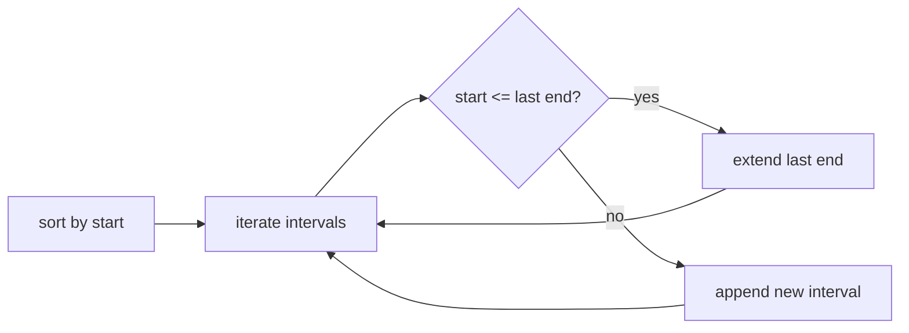

# Example: Produce the Final Algorithm Design

**Scenario**: The user confirmed a sort + linear-merge approach for "merge overlapping intervals." The assistant runs **design-algorithm** to produce the complete design per the output template.

**Applies**: **design-algorithm**

## Input / Context

Confirmed approach: sort by start time, then merge adjacent overlapping intervals.

## Expected Output

**Algorithm Name & Paradigm**: Sort + greedy linear merge (Greedy).

**Core Idea**: Sort intervals by start time so overlaps become adjacent. Walk the sorted list once, extending the current interval when the next one overlaps, and closing it otherwise.

**Pseudocode**:

```python
def merge(intervals):
    intervals.sort(key=lambda x: x[0])
    merged = []
    for start, end in intervals:
        if not merged or start > merged[-1][1]:
            merged.append([start, end])
        else:
            merged[-1][1] = max(merged[-1][1], end)
    return merged
```

**Visual Diagram**:



**Complexity Analysis**: Time O(n log n) — the sort dominates the O(n) merge. Space O(n) for the output list (O(1) excluding output).

**Key Implementation Notes**:
- Sort by start only; equal starts merge naturally.
- Use `>` (not `>=`) to treat touching intervals like `[1,2]` and `[2,3]` as separate unless merging them is intended.
- Return an empty list for empty input.
