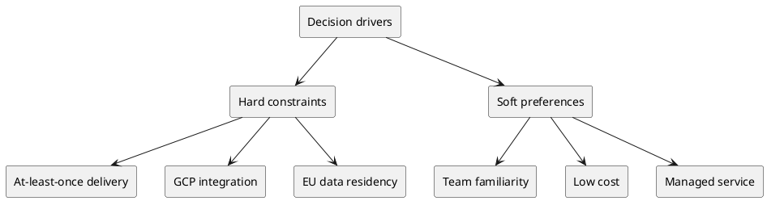
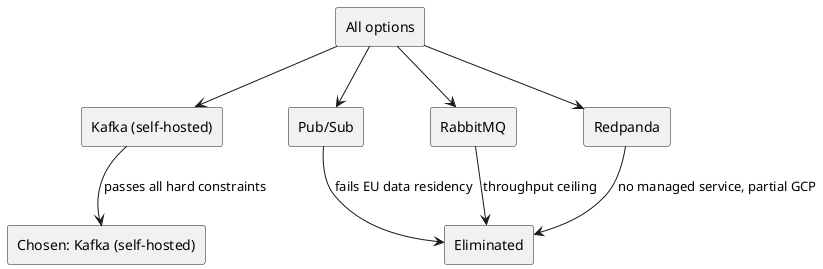
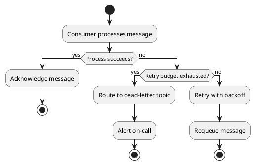

# Example: Keeping ADR Diagrams Current After Mid-Session Corrections

**Scenario**: In an ADR session about choosing a message queue, the user corrects a decision driver and introduces a new option after evaluation has started, then reveals a new dead-letter/replay flow. This example shows how **sync-diagrams** updates the affected diagrams (decision driver map, option comparison matrix, elimination tree) and adds a new diagram for the newly revealed context, so the visual record never goes stale.

**Applies**: `sync-diagrams` — triggered whenever the user corrects previously confirmed content or reveals new context mid-session. It runs on top of whatever capability handled the change (here **evaluate-options**), not as part of the linear define-problem → compile-adr sequence.

---

## Starting state (already confirmed)

- **Problem**: Choose a message queue for an order-events pipeline (~50K msgs/day).
- **Drivers (confirmed)**:
  - Hard: at-least-once delivery, GCP integration, team familiarity with Kafka
  - Soft: low cost, managed service
- **Options (confirmed)**: Apache Kafka (self-hosted), Pub/Sub (GCP), RabbitMQ
- **Evaluation so far**: Pub/Sub recommended; Kafka self-hosted dropped on operational cost; RabbitMQ dropped on throughput ceiling.

**Diagrams already in the session**:
1. C4 context diagram of the pipeline
2. Decision driver map (hard vs soft)
3. Option comparison matrix + elimination tree

---

## Correction 1: New hard constraint + new option

**User input**:
> One correction — we missed a hard constraint: all message data must stay within EU data centers. And please also consider Redpanda, which the team has been prototyping.

**Agent response (applies evaluate-options + sync-diagrams)**:
> Noted — adding "EU data residency" as a hard constraint and Redpanda as a 4th option. Let me re-evaluate Redpanda against the drivers, then sync the affected diagrams.

**Evaluation summary for Redpanda**:

| Driver | Redpanda |
|---|---|
| At-least-once delivery | ✅ |
| GCP integration | ⚠️ (runs on GCP VMs, but not a managed GCP service) |
| EU data residency | ✅ (self-hosted in EU) |
| Team familiarity | ✅ (team has been prototyping) |
| Low cost | ⚠️ (infra cost, no license fee) |
| Managed service | ❌ (self-hosted) |

**Agent output — updated decision driver map**:
> Updated: added the "EU data residency" hard constraint to the driver map.

**Agent output — updated comparison matrix + elimination tree**:
> Updated: Redpanda added to the matrix; Pub/Sub now fails the EU data residency hard constraint and is eliminated.

| Driver | Kafka (self-hosted) | Pub/Sub | RabbitMQ | Redpanda |
|---|---|---|---|---|
| At-least-once delivery | ✅ | ✅ | ✅ | ✅ |
| GCP integration | ✅ | ✅ | ✅ | ⚠️ |
| EU data residency | ✅ | ❌ (knock-out) | ✅ | ✅ |
| Team familiarity | ✅ | ✅ | ✅ | ✅ |
| Low cost | ⚠️ | ✅ | ✅ | ⚠️ |
| Managed service | ❌ | ✅ | ✅ | ❌ |

> The corrected picture now points to Kafka (self-hosted) as the recommendation, since it is the only option satisfying the new EU residency hard constraint — the recommendation flipped from Pub/Sub.

---

## New finding: dead-letter / replay flow

**User input**:
> Also worth noting: when a consumer fails repeatedly, messages should go to a dead-letter topic and be replayed later. Can we show that?

**Agent response (applies sync-diagrams — new context, no existing diagram covers it)**:
> This is new context not covered by the existing diagrams, so I'll add a new diagram for it:

> This dead-letter flowchart will be embedded in the ADR's Context section alongside the other diagrams.

---

## Final check (sync-diagrams step 5)

**Agent output**:
> Cross-check of the full diagram set:
> - C4 context diagram — unchanged, pipeline topology is unaffected ✅
> - Decision driver map — updated with the EU residency constraint ✅
> - Comparison matrix + elimination tree — updated with Redpanda and the flipped recommendation ✅
> - Dead-letter flow — new diagram covering the newly revealed context ✅
>
> Every confirmed fact is now represented in at least one diagram, and no diagram contradicts the latest state.
