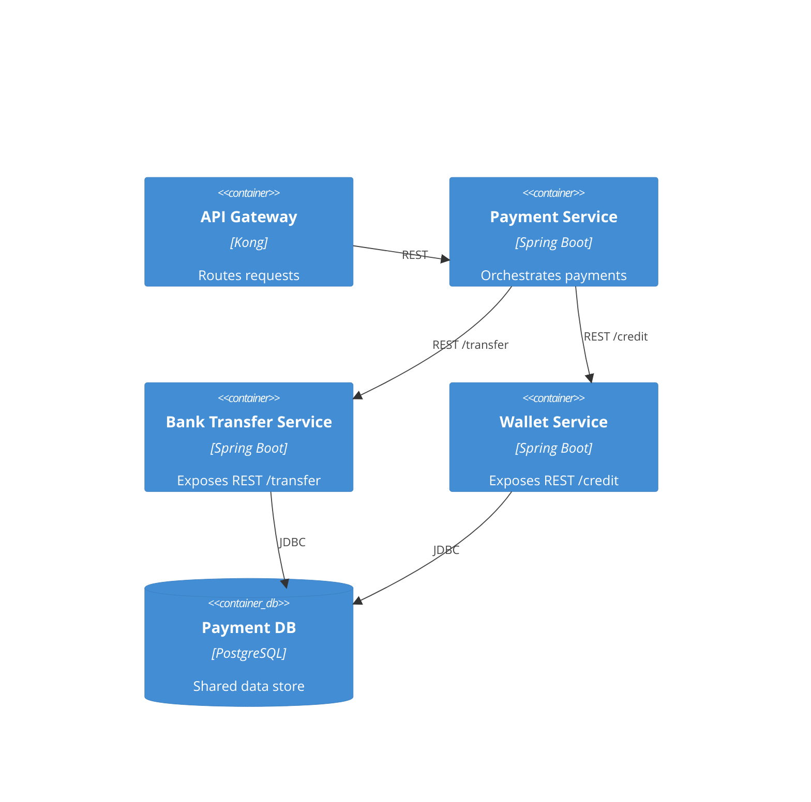
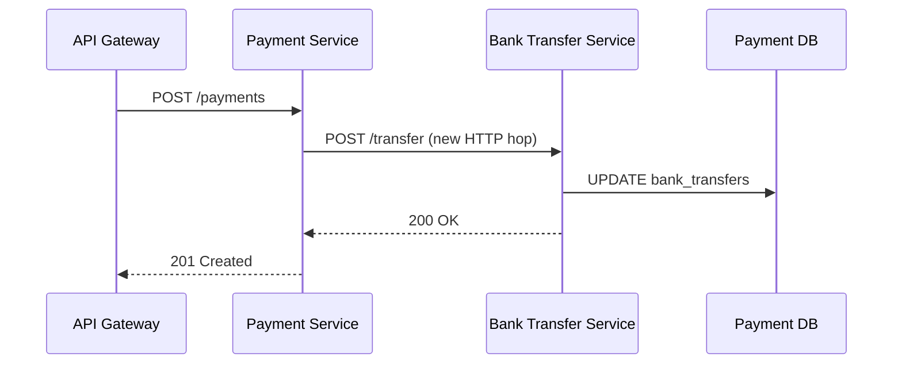
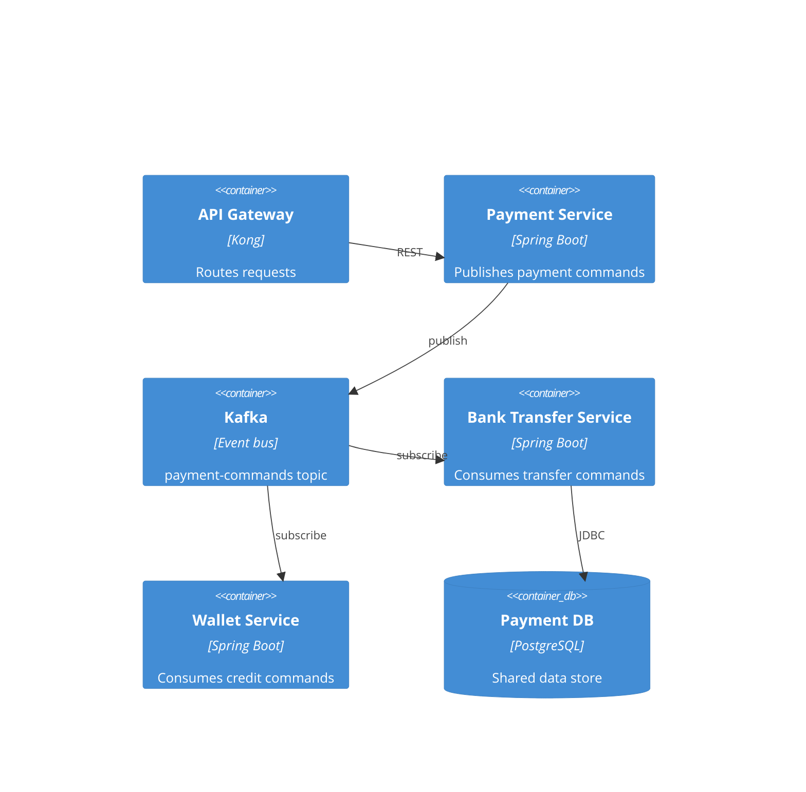
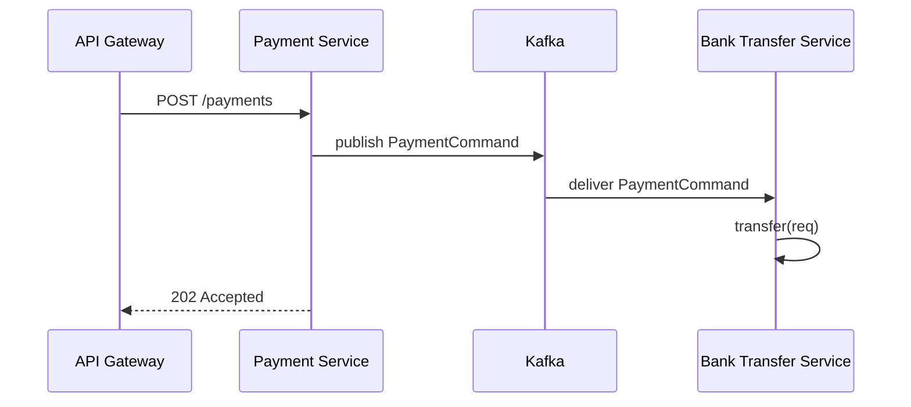

# Example: Tech Details Per Option — Inter-Service Communication

**Scenario**: While drafting the "Inter-service communication" ADR (options carried over from a payment-monolith spike), the user asks: "Show me the tech details for each option — the architecture and the actual code changes with locations — before I pick one." Each option gets its own diagrams and code diff profile.

**Applies**: `detail-options-tech` (within `evaluate-options`), rendered into the ADR by `compile-adr`.

**What makes this distinct**: Per-option tech details grounded in an existing evidence base (the spike's code reference) — every diff carries a `file:line`, every claim a confidence tag, nothing assumed.

---

## Input / Context

### Options being evaluated

| Option | Description | Pros | Cons |
|---|---|---|---|
| A: Synchronous REST | Services call each other via REST APIs | Simple; team familiar | Tight coupling; cascading failures |
| B: Async events (Kafka) | Services communicate via event streams | Loose coupling; resilience | Learning curve; eventual consistency |
| C: Hybrid | REST for queries, events for commands | Best of both worlds | Two patterns to maintain |

### Evidence base — code reference slice (from the spike)

| Location | Symbol | Role |
|---|---|---|
| `PaymentOrchestrator.java:142` | `processPayment(Order)` | In-process calls to bank transfer + wallet credit |
| `BankTransferService.java:88` | `transfer(TransferRequest)` | Executes bank-transfer DB writes |
| `WalletService.java:120` | `credit(WalletCredit)` | Executes wallet-credit DB writes |
| `pom.xml:21` | dependencies | Spring Boot starters (verified: no Kafka) |
| `application.yml:52` | `payment.services` | Service URL config block |

Findings-doc current state: single monolith — `PaymentOrchestrator` calls `BankTransferService` and `WalletService` in-process, one shared `Payment DB`.

---

## Expected output — per-option tech details

### Option A: Synchronous REST

#### Target-state diagram (C4 container)



#### Sequence: payment flow



#### Code changes

1. **`BankTransferService.java:88` — `transfer(TransferRequest)`** (verified)
   - Current: plain method `public void transfer(TransferRequest req)`, called only in-process.
   - Diff:
     ```diff
     diff --git a/src/main/java/com/pay/BankTransferService.java b/src/main/java/com/pay/BankTransferService.java
     --- a/src/main/java/com/pay/BankTransferService.java
     +++ b/src/main/java/com/pay/BankTransferService.java
     @@ -1,4 +1,6 @@
     +@RestController
     +@RequestMapping("/transfer")
      @Service
      public class BankTransferService {
     @@ -88,7 +92,12 @@ public class BankTransferService {
      public void transfer(TransferRequest req) {
        ...
      }
     +
     +  @PostMapping
     +  public void transferEndpoint(@RequestBody TransferRequest req) {
     +    transfer(req);
     +  }
     }
     ```
   - How: annotate the class with `@RestController` + `@RequestMapping("/transfer")`, add a thin REST wrapper that delegates to the existing `transfer`.

2. **`PaymentOrchestrator.java:142` — `processPayment(Order)`** (verified)
   - Current: `bankTransferService.transfer(req)` — direct in-process call.
   - Diff:
     ```diff
     diff --git a/src/main/java/com/pay/PaymentOrchestrator.java b/src/main/java/com/pay/PaymentOrchestrator.java
     --- a/src/main/java/com/pay/PaymentOrchestrator.java
     +++ b/src/main/java/com/pay/PaymentOrchestrator.java
     @@ -142,7 +142,7 @@ public class PaymentOrchestrator {
     -    bankTransferService.transfer(req);
     +    restTemplate.postForObject(btUrl + "/transfer", req, Void.class);
     ```
   - How: replace the in-process call with a REST client call to the bank-transfer service URL.

3. **`application.yml:52` — `payment.services`** (inferred: shape read, new value)
   - Current: block exists with no bank-transfer URL.
   - Diff:
     ```diff
     diff --git a/src/main/resources/application.yml b/src/main/resources/application.yml
     --- a/src/main/resources/application.yml
     +++ b/src/main/resources/application.yml
     @@ -52,4 +52,5 @@ payment:
       services:
     +    bank-transfer: http://bank-transfer:8080
     ```
   - How: add the URL under the existing `payment.services` block.

Note: `pom.xml:21` already includes `spring-web` (verified), so no new dependency. Every change is spelled out — no prior knowledge assumed.

---

### Option B: Async events (Kafka)

#### Target-state diagram (C4 container)



#### Sequence: payment flow



#### Code changes

1. **`pom.xml:21` — dependencies** (verified: no Kafka present)
   - Diff:
     ```diff
     diff --git a/pom.xml b/pom.xml
     --- a/pom.xml
     +++ b/pom.xml
     @@ -21,6 +21,9 @@
       <dependency>
         <groupId>org.springframework.boot</groupId>
         <artifactId>spring-boot-starter-web</artifactId>
       </dependency>
     +  <dependency>
     +    <groupId>org.springframework.kafka</groupId>
     +    <artifactId>spring-kafka</artifactId>
     +  </dependency>
     ```
   - How: add the Spring Kafka starter dependency.

2. **`PaymentOrchestrator.java:142` — `processPayment(Order)`** (verified)
   - Current: `bankTransferService.transfer(req)` — direct in-process call.
   - Diff:
     ```diff
     diff --git a/src/main/java/com/pay/PaymentOrchestrator.java b/src/main/java/com/pay/PaymentOrchestrator.java
     --- a/src/main/java/com/pay/PaymentOrchestrator.java
     +++ b/src/main/java/com/pay/PaymentOrchestrator.java
     @@ -142,7 +142,7 @@ public class PaymentOrchestrator {
     -    bankTransferService.transfer(req);
     +    kafkaTemplate.send("payment-commands", new PaymentCommand(order));
     ```
   - How: publish a command event instead of calling in-process.

3. **`BankTransferService.java:88` — `transfer(TransferRequest)`** (verified)
   - Diff:
     ```diff
     diff --git a/src/main/java/com/pay/BankTransferService.java b/src/main/java/com/pay/BankTransferService.java
     --- a/src/main/java/com/pay/BankTransferService.java
     +++ b/src/main/java/com/pay/BankTransferService.java
     @@ -88,7 +88,13 @@ public class BankTransferService {
      public void transfer(TransferRequest req) {
        ...
      }
     +
     +  @KafkaListener(topics = "payment-commands")
     +  public void onPaymentCommand(PaymentCommand cmd) {
     +    transfer(cmd.toRequest());
     +  }
     }
     ```
   - How: add a listener that delegates to the existing `transfer`.

4. **`application.yml:52`** (inferred: shape read, new values)
   - Diff:
     ```diff
     diff --git a/src/main/resources/application.yml b/src/main/resources/application.yml
     --- a/src/main/resources/application.yml
     +++ b/src/main/resources/application.yml
     @@ -52,4 +52,7 @@ spring:
       application:
         name: payment-service
     +  kafka:
     +    bootstrap-servers: kafka:9092
     ```
   - How: add Kafka bootstrap config under the existing `spring` block.

Note: the `PaymentCommand` DTO and topic name are **unverified** additions — flagged and offered as a follow-up investigation. The response becomes `202 Accepted` (async), reflected in the sequence diagram.

---

## How it renders in the ADR

The confirmed tech details inform the recommendation (Option A: few, small verified diffs; Option B: new dependency, listener, async semantics). At `compile-adr`, each option's evaluation section carries a `#### Tech Details` subsection with the target-state diagram and the code change profile — so reviewers see the concrete implementation of every option, not just pros/cons.
