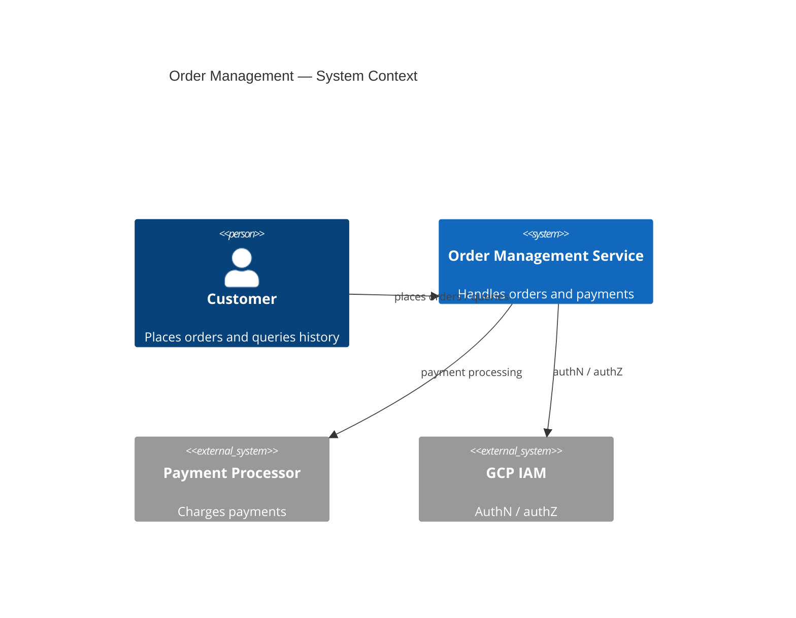
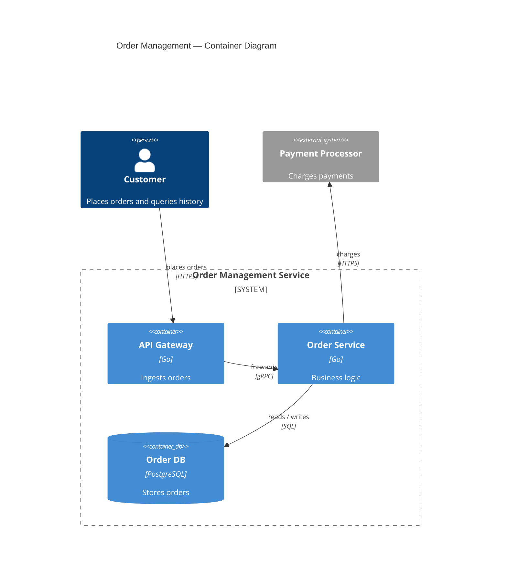
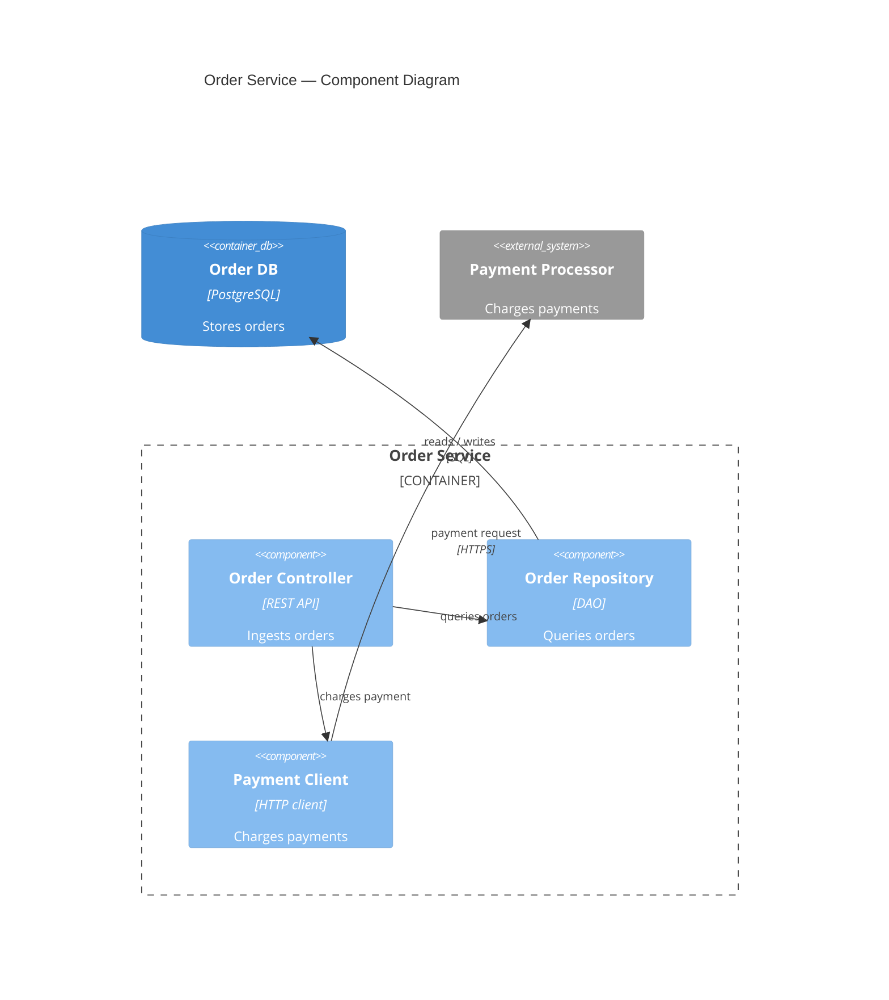
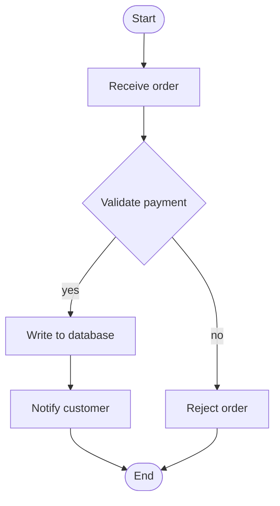
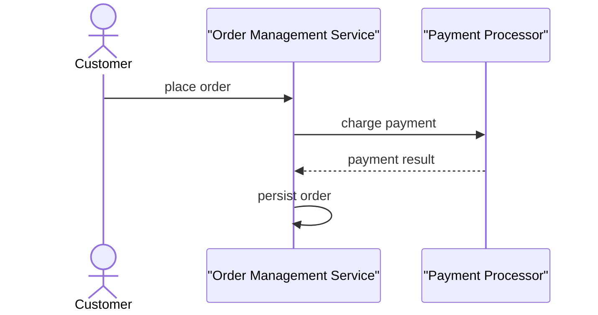
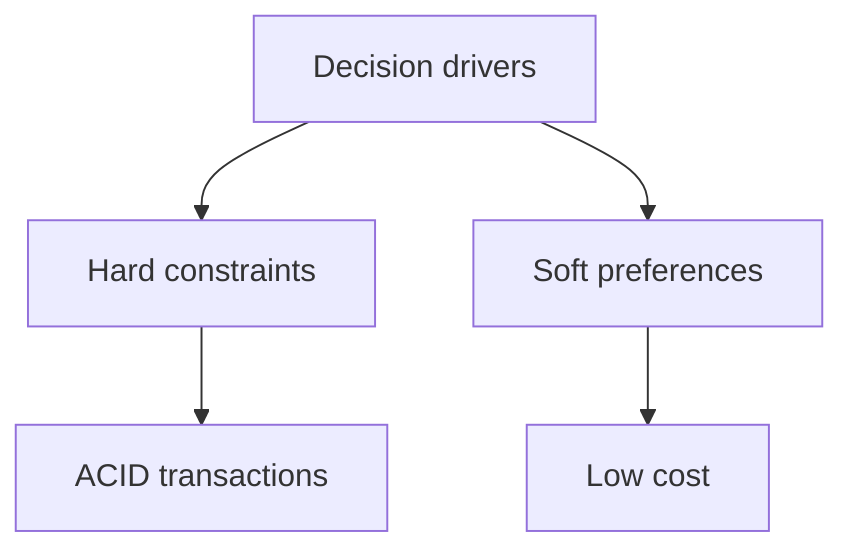
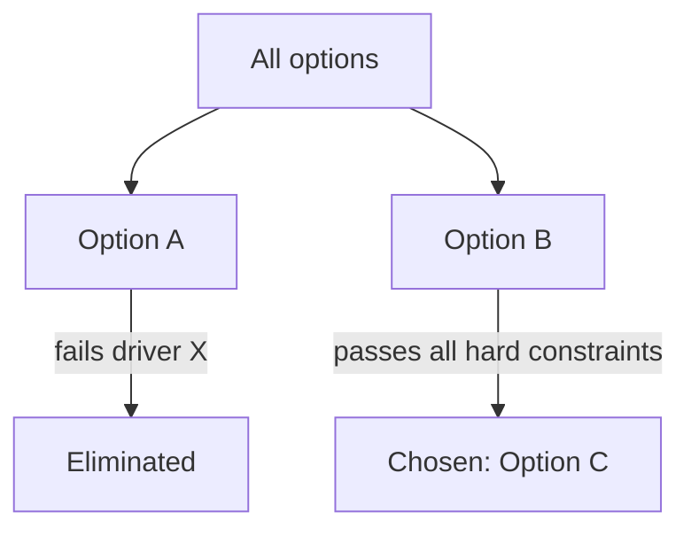

# Diagram Guide for ADR Drafting

This guide supports the **diagram-selection** knowledge entry. Load it when actually drawing a diagram for an ADR.

## Proactive Diagramming Principles

- Draw a diagram the moment you explain context or a solution — never wait for the user to ask.
- Choose the diagram type by the context you want to explain, not by which ADR step you are in.
- One diagram = one message. If two messages are needed, draw two diagrams.
- Draw all diagrams with Mermaid inside a fenced code block with `mermaid` language tag.
- Keep diagrams small: 4–9 nodes for context diagrams; use sub-packages instead of merging messages.

## Zooming In

Start with a C4 context diagram for the big picture, then zoom into the part of the context you are explaining:

- Follow the **C4 levels** for structure: context (level 1) → container (level 2) → component (level 3).
- Use a **flowchart** when the explanation is about a process or workflow — step by step, with decision branches.
- Use a **sequence diagram** when the explanation is about interactions — who calls whom, in what order, and whether calls are synchronous or asynchronous.

The solution architecture of an ADR is itself a C4/flowchart view of the target state: draw it the same way, adding the chosen option as a named system/container and marking what changes because of the decision.

## Mermaid C4 Reference

Mermaid has native C4 support — use `C4Context` (level 1), `C4Container` (level 2), `C4Component` (level 3). Syntax is compatible with C4-PlantUML; no `@startuml`/`@enduml` is needed, just start with the diagram type and an optional `title`:

| Element | Mermaid syntax | Example |
|---|---|---|
| Person (actor) | `Person(alias, "Label", "Descr")` | `Person(customer, "Customer", "Places orders")` |
| System in scope | `System(alias, "Label", "Descr")` | `System(oms, "Order Management Service", "Handles orders")` |
| External system | `System_Ext(alias, "Label", "Descr")` | `System_Ext(ps, "Payment Processor", "Charges payments")` |
| Container | `Container(alias, "Label", "Tech", "Descr")` | `Container(api, "API Gateway", "Go", "Ingests orders")` |
| Database / store | `ContainerDb(alias, "Label", "Tech", "Descr")` | `ContainerDb(db, "Order DB", "PostgreSQL", "Stores orders")` |
| Component | `Component(alias, "Label", "Tech", "Descr")` | `Component(oc, "Order Controller", "REST", "Ingests orders")` |
| Relationship | `Rel(from, to, "Label", "Tech")` | `Rel(customer, oms, "places orders")` |
| Grouping | `System_Boundary(alias, "Label") { ... }` / `Container_Boundary(alias, "Label") { ... }` | `System_Boundary(oms, "Order Management Service") { ... }` |

Rules:

- Show the system(s) IN scope as the center of the diagram; keep internal containers/databases out of a level-1 context diagram.
- Show only direct relationships; no message-level detail at this level.
- Label every relationship with what flows across it (data, request, event).
- Mark external elements with the `_Ext` suffix (`System_Ext`, `Container_Ext`, `Component_Ext`).

## C4 Context Diagram (Level 1)

- Center the system(s) in scope; place actors to the left and external systems to the right.
- Connect with `Rel(from, to, "Label", "Tech")` only — no message-level detail at this level.

## C4 Container Diagram (Level 2)

- Zoom into a system: place its top-level containers (applications, data stores, microservices) inside a `System_Boundary`.
- Name each container with `Container(alias, "Label", "Tech", "Descr")` and note its main technology.
- Connect containers with `Rel(from, to, "Label", "Tech")` describing what flows between them.

## C4 Component Diagram (Level 3)

- Zoom into a single container: wrap its internal components in a `Container_Boundary`.
- Give each component a one-line responsibility in its description.
- Connect components with `Rel`; mark external dependencies with the `_Ext` suffix and keep dependencies pointing in a clean direction.

## Flowchart

- Show the sequence of steps and the decision branches that matter to the explanation.
- Use `([...])` stadium nodes for start/end, `[...]` rectangles for steps, `{...}` diamonds for decisions, and `-->|yes| / -->|no|` labeled edges for branches.
- Keep each branch readable — extract a second diagram instead of packing in more branches.

## Sequence Diagram

- Name each participant (actor, system, component) as a lifeline with `actor` / `participant`.
- Show messages top-to-bottom in time order.
- Use `->>` for synchronous calls and `-->>` for asynchronous calls/returns.
- Highlight the interaction that matters for the decision (e.g., a revocation path, a payment flow).

## Decision Driver Map

A tree that separates hard constraints from soft preferences — use `subgraph`s for the two branches:

- Root: "Decision drivers"
- Branch 1: "Hard constraints (knock-out)" → each must-have driver
- Branch 2: "Soft preferences" → each nice-to-have driver

## Option Comparison Matrix + Elimination Tree

A drivers × options grid using three visual states:

- ✅ satisfies the driver
- ⚠️ partially satisfies / conditional
- ❌ fails the driver (mark knock-out failures prominently)

Pair the matrix with an elimination tree (`flowchart`) when explaining WHY options were dropped:

- Start node: all considered options
- For each eliminated option: edge labeled with the failing driver → "Eliminated"
- For the chosen option: edge labeled "passes all hard constraints" → "Chosen"

## Mermaid Snippets

### C4 context diagram

### C4 container diagram

### C4 component diagram

### Flowchart (zoom into a flow)

### Sequence diagram (zoom into interactions)

### Decision driver map

### Elimination tree

## Updating and Extending Diagrams

Diagrams are living artifacts of the ADR session: sync them whenever the user confirms a new finding or correction, so the visual record never goes stale.

- **Update in place when the change affects an existing diagram**: keep the same diagram identity (title, aliases, structure) and change only what is affected. State the delta in one line before the updated code block (e.g., "Updated: added the analytics system and its relationship to the OMS").
- **Add a new diagram when the context is genuinely new**: a flow, zoom level, or edge case no existing diagram covers. Give it a distinct title; do not overload an existing diagram with extra branches.
- **Preserve identity**: when updating, keep the same aliases and labels so readers can diff old vs. new easily.
- **Keep the set consistent**: after every change, each confirmed fact appears in at least one diagram, and no diagram contradicts the latest confirmed state. Cross-check the whole set before proceeding.
- **Never leave stale visuals**: if a diagram depicts an obsolete state, update or replace it — do not leave both the old and new versions in the session.

## Cross-References

- Selection logic (which diagram to draw for which context): **diagram-selection** in `SKILL.md`
- When to update vs. add diagrams after corrections: **diagram-sync** in `SKILL.md`
- Where diagrams appear in the final document: `reference/adr-template.md`
