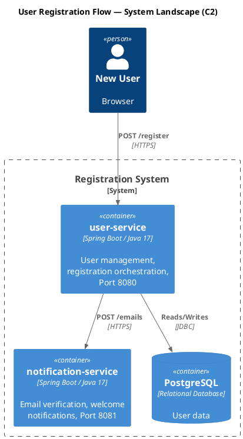
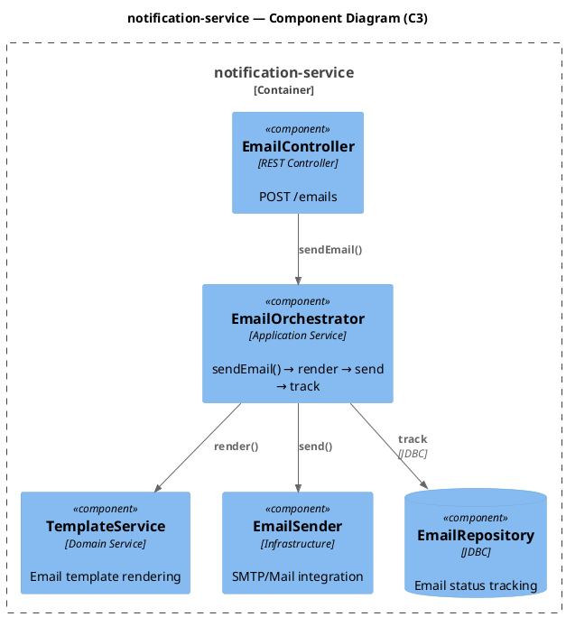
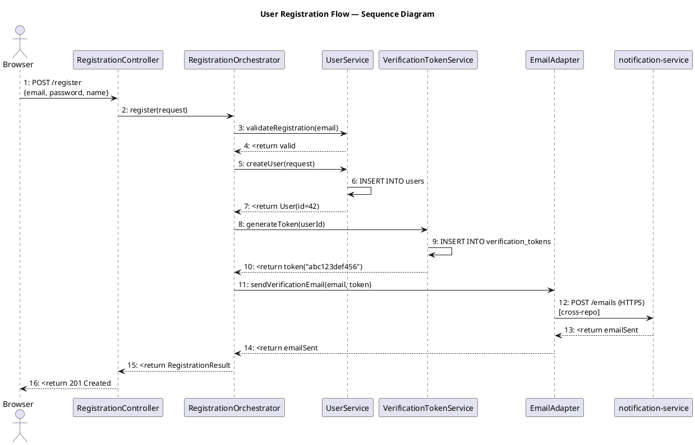

# Example: Full Markdown Report Output

## User Request
"Please investigate the user registration flow and output all findings in a markdown document."

## Response: Markdown Report

Applies `<compile-markdown-report>`.

```markdown
# Investigation Report: User Registration Flow

> **Date**: 2026-07-21
> **Scope**: `user-service`, `notification-service` (2 repositories)
> **Flow**: User registration end-to-end

---

## 1. System Overview (C2 Level)

### Repositories Involved

| Repository | Description | Port | Language/Framework |
|---|---|---|---|
| `user-service` | User management, registration orchestration | 8080 | Spring Boot / Java 17 |
| `notification-service` | Email verification, welcome notifications | 8081 | Spring Boot / Java 17 |

### Dependency Matrix

| Source | Target | Protocol | Direction | Description |
|---|---|---|---|---|
| `user-service` | `notification-service` | HTTP REST (`POST /emails`) | Outbound | Sends verification email |
| `user-service` | PostgreSQL (`user-db`) | JDBC | Read/Write | Stores user data |
| `notification-service` | PostgreSQL (`notification-db`) | JDBC | Read/Write | Tracks email status |

### C2 Container Diagram



---

## 2. Component Internals (C3 Level)

### `user-service` Components

```plantuml
@startuml
!include <C4/C4_Component>

title user-service — Component Diagram (C3)

Container_Boundary(user_service, "user-service") {
    Component(reg_ctrl, "RegistrationController", "REST Controller", "POST /register")
    Component(verify_ctrl, "EmailVerificationController", "REST Controller", "GET /verify?token=xxx")
    Component(reg_orch, "RegistrationOrchestrator", "Application Service", "register() → validate → create → notify")
    Component(user_svc, "UserService", "Domain Service", "User creation and validation")
    Component(token_svc, "VerificationTokenService", "Domain Service", "Token generation and validation")
    Component(email_adapter, "EmailAdapter", "HTTP Client", "Calls notification-service")
    ComponentDb(user_repo, "UserRepository", "JDBC", "User persistence")
    ComponentDb(token_repo, "VerificationTokenRepository", "JDBC", "Token persistence")
}

Container(notification_service, "notification-service", "Spring Boot", "External email service", $external=true)

Rel(reg_ctrl, reg_orch, "register()")
Rel(verify_ctrl, token_svc, "verify(token)")
Rel(reg_orch, user_svc, "validateRegistration(), createUser()")
Rel(reg_orch, token_svc, "generateToken()")
Rel(reg_orch, email_adapter, "sendVerificationEmail()")
Rel(user_svc, user_repo, "Reads/Writes", "JDBC")
Rel(token_svc, token_repo, "Reads/Writes", "JDBC")
Rel(email_adapter, notification_service, "POST /emails", "HTTPS")

@enduml
```

### `notification-service` Components



---

## 3. Sequence Diagram: User Registration



**Message sequence**:
```
 1: POST /register (Body: {email, password, name})
 2: RegistrationOrchestrator.register(request)
 3:   UserService.validateRegistration(email) — check duplicate
 4:   ← valid
 5:   UserService.createUser(request) — persist user
 6:     INSERT INTO users
 7:   ← User(id=42, email="user@example.com")
 8:   VerificationTokenService.generateToken(userId) — persist token
 9:     INSERT INTO verification_tokens
10:   ← token("abc123def456")
11:   EmailAdapter.sendVerificationEmail(email, token)
12:     POST /emails (HTTPS) [cross-repo → notification-service]
13:   ← emailSent
14: ← emailSent
15: ← RegistrationResult(userId=42, status=VERIFICATION_PENDING)
16: ← 201 Created (Location: /users/42)
```

---

## 4. Call Stack Trace: `RegistrationOrchestrator.register()`

```
[1] RegistrationOrchestrator.register(request: RegistrationRequest)
  File: user-service/src/main/java/.../RegistrationOrchestrator.java:28
  Parameters: request={email="user@example.com", password="[HASHED]", name="John"}
  Returns: RegistrationResult(userId=42, status=VERIFICATION_PENDING)
  Code:
  │  28: public RegistrationResult register(RegistrationRequest request) {
  │  29:     userService.validateRegistration(request.getEmail());
  │  30:     User user = userService.createUser(request);
  │  31:     VerificationToken token = verificationTokenService.generateToken(user.getId());
  │  32:     emailAdapter.sendVerificationEmail(user.getEmail(), token);
  │  33:     return new RegistrationResult(user.getId(), Status.VERIFICATION_PENDING);
  ├─→ [2] UserService.validateRegistration(email)
  ├─→ [3] UserService.createUser(request)
  ├─→ [4] VerificationTokenService.generateToken(userId)
  ╰─→ [5] EmailAdapter.sendVerificationEmail(email, token)

[2] UserService.validateRegistration(email: String)
  File: user-service/src/main/java/.../UserService.java:45
  Parameters: email="user@example.com"
  Returns: void (throws DuplicateEmailException if exists)
  Code:
  │  45: public void validateRegistration(String email) {
  │  46:     if (userRepository.existsByEmail(email)) {
  │  47:         throw new DuplicateEmailException("Email already registered: " + email);
  │  48:     }

[3] UserService.createUser(request: RegistrationRequest)
  File: user-service/src/main/java/.../UserService.java:55
  Parameters: request={email="user@example.com", ...}
  Returns: User(id=42, email="user@example.com", status=ACTIVE)
  Code:
  │  55: public User createUser(RegistrationRequest request) {
  │  56:     User user = new User(request.getEmail(), passwordEncoder.encode(request.getPassword()));
  │  57:     user.setName(request.getName());
  │  58:     return userRepository.save(user);
  ├─→ [3a] UserRepository.save(user) — INSERT INTO users (email, password, name) VALUES (?, ?, ?)

[4] VerificationTokenService.generateToken(userId: Long)
  File: user-service/src/main/java/.../VerificationTokenService.java:22
  Parameters: userId=42
  Returns: VerificationToken(id=101, token="abc123def456", userId=42, expiresAt=...)
  Code:
  │  22: public VerificationToken generateToken(Long userId) {
  │  23:     VerificationToken token = new VerificationToken(userId, UUID.randomUUID().toString());
  │  24:     token.setExpiresAt(LocalDateTime.now().plusHours(24));
  │  25:     return tokenRepository.save(token);

[5] EmailAdapter.sendVerificationEmail(email: String, token: VerificationToken)
  File: user-service/src/main/java/.../EmailAdapter.java:33
  Parameters: email="user@example.com", token="abc123def456"
  Returns: EmailResult(status=SENT, messageId="msg-789")
  Code:
  │  33: public EmailResult sendVerificationEmail(String email, VerificationToken token) {
  │  34:     String link = "https://example.com/verify?token=" + token.getValue();
  │  35:     EmailRequest req = new EmailRequest(email, "Please verify your email", link);
  │  36:     ResponseEntity<EmailResponse> resp = restTemplate.postForEntity(
  │  37:         "http://notification-service/api/emails", req, EmailResponse.class);
  │  38:     return EmailResult.fromResponse(resp.getBody());
  ╰─→ HTTP POST http://notification-service/api/emails [cross-repo → notification-service]
```

---

## 5. Key Design Decisions

| Decision | Rationale | Trade-off |
|---|---|---|
| Async email verification | User can close browser while waiting; verification via link | Extra state to manage (pending/verified) |
| Verification token with 24h expiry | Security best practice | Users may need resend mechanism |
| Separate notification-service | Separation of concerns, independent scaling | Added network hop for email sending |
| REST between services | Simplicity for low-volume flow | Synchronous coupling on registration path |

---

## 6. Edge Cases & Considerations

- **Duplicate email**: Handled by `UserService.validateRegistration()` with `DuplicateEmailException`
- **Email delivery failure**: `EmailAdapter` has 3 retries with exponential backoff; after 3rd failure, user is created but marked `VERIFICATION_PENDING` with a flag `email_send_failed=true`
- **Token expiry**: Verification endpoint returns `410 GONE` if token expired; user can request new token
- **Database constraints**: Unique index on `users.email` prevents race conditions

---

## 7. Next Steps for Deeper Investigation

- [ ] View `VerificationTokenService` implementation for token expiry and cleanup logic
- [ ] Examine `notification-service` for email template rendering and SMTP configuration
- [ ] Review rate limiting on `POST /register` endpoint
- [ ] Check monitoring/logging for registration failures
```
