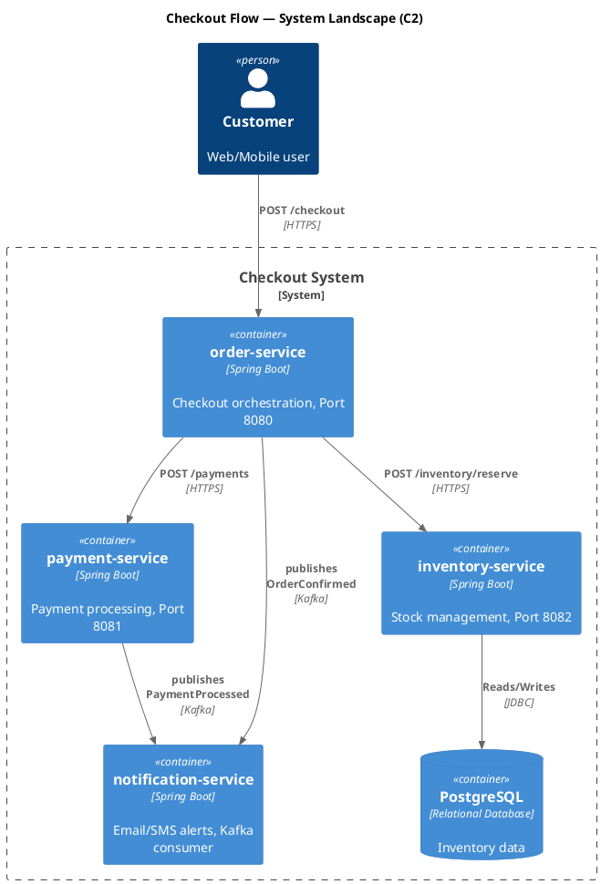

# Example: Cross-Repo Dependency Analysis with C2 Container Diagram

## User Request
"I want to understand how the 'checkout' flow works across all our microservices. We have `order-service`, `payment-service`, `inventory-service`, and `notification-service`."

## Response

### Step 1 — Analyze Multi-Repo Structure

Applies `<analyze-cross-repo-dependencies>`.

**Discovered repositories and their roles**:

| Repo | Description | Technology |
|---|---|---|
| `order-service` | Manages orders, checkout orchestration | Spring Boot, REST API |
| `payment-service` | Processes payments, handles refunds | Spring Boot, REST API |
| `inventory-service` | Manages stock levels, reservation | Spring Boot + PostgreSQL |
| `notification-service` | Sends email/SMS notifications | Spring Boot + Kafka consumer |

**Discovered dependencies (from code analysis)**:

| Source | Target | Type | Details |
|---|---|---|---|
| `order-service` | `payment-service` | HTTP REST (`POST /payments`) | Process payment on checkout |
| `order-service` | `inventory-service` | HTTP REST (`POST /inventory/reserve`) | Reserve items on checkout |
| `order-service` | `notification-service` | Kafka event (`OrderConfirmed`) | Publish after successful checkout |
| `inventory-service` | PostgreSQL | JDBC | Read/write stock levels |
| `payment-service` | `notification-service` | Kafka event (`PaymentProcessed`) | Publish after payment success |

### Step 2 — Draw C2 Container Diagram

Applies `<draw-c4-diagram>`.

**Diagram explanation**:
1. **Customer** initiates checkout via `POST /checkout` on `order-service`
2. `order-service` orchestrates the flow by calling `payment-service` (process payment) and `inventory-service` (reserve stock) in parallel
3. On success, `order-service` publishes `OrderConfirmed` event to Kafka
4. `payment-service` publishes `PaymentProcessed` event to Kafka
5. `notification-service` consumes both events and sends appropriate notifications

### Step 3 — Offer Zoom-in

**Agent**: "Would you like to zoom into any of these containers? For example:
- **order-service**: See how checkout orchestration works internally
- **payment-service**: See payment processing pipeline
- **inventory-service**: See stock reservation logic"

### Cross-Repo Dependency Table

| Dependency | Direction | Protocol | SLA / Timeout | Error handling |
|---|---|---|---|---|
| `order-service` → `payment-service` | Outbound | HTTP REST | 5s timeout, 3 retries | Circuit breaker (50% failure → open for 30s) |
| `order-service` → `inventory-service` | Outbound | HTTP REST | 3s timeout, 1 retry | Fail-fast on timeout |
| `order-service` → Kafka | Outbound | Async event | At-least-once delivery | Retry on send failure |
| `payment-service` → Kafka | Outbound | Async event | At-least-once delivery | Retry on send failure |
| `notification-service` ← Kafka | Inbound | Async event | Auto-commit after processing | Dead-letter queue on failure |
