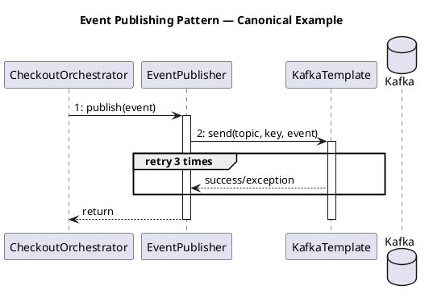

# Example: Pattern Discovery with Inconsistency Detection

## User Request
"How does the event publishing pattern work across our services? Do all services follow the same approach?"

## Response

### Step 1 — Investigate a Specific Feature

First, investigate one concrete example: the `OrderConfirmed` event publishing in `order-service`.

Applies investigate-codebase → trace-call-stack.

```
Call chain for OrderConfirmed publishing:
  CheckoutOrchestrator.checkout() → EventPublisher.publish(OrderConfirmedEvent)
```

Extracted **structural fingerprint**:
```
Entry:       REST POST /checkout (synchronous request)
Layer chain: Controller → Orchestrator → EventPublisher (interface)
               → KafkaTemplate.send(topic, key, event)
Stereotypes: @Service on orchestrator, @Component on publisher
External:    Kafka topic "order.confirmed"
Error:       Retry 3× on send failure, log + continue on final failure
Config:      spring.kafka.template.default-topic in application.yml
```

### Step 2 — Search for Similar Features

Applies `<discover-implementation-patterns>` — pattern-discovery strategies.

Searching for other event publishing implementations across all repos:

**Candidate 1: `payment-service` — `PaymentProcessed` event**
```
Entry:       REST POST /payments
Layer chain: PaymentController → PaymentOrchestrator → EventPublisher
               → KafkaTemplate.send(topic, key, event)
Stereotypes: @RestController, @Service, @Component
External:    Kafka topic "payment.processed"
Error:       Retry 3× on send failure, log + continue
Config:      spring.kafka.template.default-topic
→ ✓ Match — identical pattern
```

**Candidate 2: `notification-service` — `EmailSent` event**
```
Entry:       REST POST /emails
Layer chain: EmailController → EmailOrchestrator → EventPublisher
               → KafkaTemplate.send(topic, key, event)
Stereotypes: @RestController, @Service, @Component
External:    Kafka topic "notification.email.sent"
Error:       Retry 3× on send failure, log + continue
Config:      spring.kafka.template.default-topic
→ ✓ Match — identical pattern
```

**Candidate 3: `inventory-service` — `StockReserved` event**
```
Entry:       REST POST /inventory/reserve
Layer chain: InventoryController → InventoryService → KafkaTemplate.send()
               (no EventPublisher interface — direct KafkaTemplate usage)
Stereotypes: @RestController, @Service
External:    Kafka topic "stock.reserved"
Error:       No retry — fails immediately with exception
Config:      KafkaProducerConfig manually defined
→ ✗ Variant — different layer chain, missing EventPublisher abstraction, different error handling
```

### Step 3 — Pattern Synthesis

Applies `<discover-implementation-patterns>`.

```
⚠️ Inconsistency detected: Event publishing follows 2 different patterns
```

**Pattern 1 (Consistent — 3 services)** — Service-majority approach:

```
Controller → Orchestrator → EventPublisher interface → KafkaTemplate → Kafka
```

| Service | Event | Status |
|---|---|---|
| `order-service` | `OrderConfirmed` | ✓ Match |
| `payment-service` | `PaymentProcessed` | ✓ Match |
| `notification-service` | `EmailSent` | ✓ Match |

**Canonical Example** (using `order-service`):



**Pattern 2 (Variant — 1 service)** — Direct usage, no abstraction:

```
Controller → Service → KafkaTemplate.send() → Kafka
```

| Service | Event | Status |
|---|---|---|
| `inventory-service` | `StockReserved` | ✗ Variant |

**Differences from Pattern 1**:
- **Missing `EventPublisher` interface** — couples service logic directly to Kafka API
- **No retry** — send failure propagates as unhandled exception, causing HTTP 500
- **Custom `KafkaProducerConfig`** — instead of relying on `spring.kafka.template.default-topic`
- **Manual topic name string** — instead of typed event class

### Step 4 — Present Findings

**Recommendation**: Standardize `inventory-service` to Pattern 1:
1. Introduce an `EventPublisher` interface and implementation
2. Add retry handling (consistent with the other 3 services)
3. Remove custom `KafkaProducerConfig` — use auto-configuration
4. Consider extracting a shared `EventPublisher` library for all services
