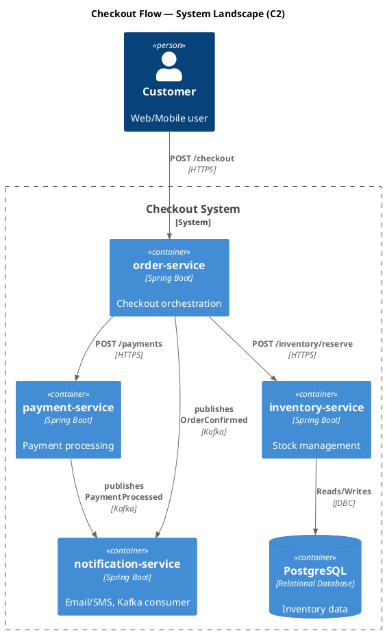

# Example: Progressive Zoom-in — Checkout Flow

## User Request
"I want to fully understand how the checkout flow works, from the API call to the confirmation. Please show me all levels."

## Response

### Level 1: C2 Container Diagram (System Landscape)

Applies `<draw-c4-diagram>` (C2 level).



**Key observations**:
- `order-service` is the orchestrator — it receives the checkout request and coordinates payment + inventory
- `payment-service` and `inventory-service` are called in parallel
- `notification-service` reacts to events asynchronously

---

### Level 2: C3 Component Diagram (order-service Internals)

Applies `<draw-c4-diagram>` (C3 level).

```plantuml
@startuml
!include <C4/C4_Component>

title order-service — Component Diagram (C3)

Container_Boundary(order_service, "order-service") {
    Component(checkout_ctrl, "CheckoutController", "REST Controller", "POST /checkout endpoint")
    Component(order_listener, "OrderEventListener", "Kafka Consumer", "Listens for PaymentProcessed")
    Component(checkout_orch, "CheckoutOrchestrator", "Application Service", "Orchestrates checkout flow")
    Component(order_svc, "OrderService", "Domain Service", "Order creation and lifecycle")
    Component(payment_adapter, "PaymentAdapter", "HTTP Client", "Calls payment-service")
    Component(inventory_adapter, "InventoryAdapter", "HTTP Client", "Calls inventory-service")
    Component(event_publisher, "EventPublisher", "Kafka Publisher", "Publishes domain events")
    ComponentDb(order_db, "Order DB", "PostgreSQL", "Order persistence")
}

Container(payment_service, "payment-service", "Spring Boot", "External payment service", $external=true)
Container(inventory_service, "inventory-service", "Spring Boot", "External inventory service", $external=true)

Rel(checkout_ctrl, checkout_orch, "checkout()")
Rel(checkout_orch, order_svc, "createOrder(), confirmOrder()")
Rel(checkout_orch, payment_adapter, "processPayment()")
Rel(checkout_orch, inventory_adapter, "reserveItems()")
Rel(checkout_orch, event_publisher, "publish(OrderConfirmed)")
Rel(order_svc, order_db, "Reads/Writes", "JDBC")
Rel(payment_adapter, payment_service, "POST /payments", "HTTPS")
Rel(inventory_adapter, inventory_service, "POST /inventory/reserve", "HTTPS")
Rel(order_listener, checkout_orch, "onPaymentProcessed()")

@enduml
```

**Component responsibilities**:
- **CheckoutController**: REST endpoint, validates request, delegates to `CheckoutOrchestrator`
- **CheckoutOrchestrator**: Core business logic — orchestrates payment, inventory reservation, order persistence
- **OrderService**: Domain logic for order creation, status management
- **PaymentAdapter**: HTTP client to `payment-service`, handles retry/circuit-breaker
- **InventoryAdapter**: HTTP client to `inventory-service`, handles timeout
- **OrderEventListener**: Consumes `PaymentProcessed` event from Kafka, updates order status

---

### Level 3: Sequence Diagram — Checkout Flow

Applies `<draw-sequence-diagram>`.

```plantuml
@startuml
title Checkout Flow — Sequence Diagram

actor Customer
participant "CheckoutController" as Ctrl
participant "CheckoutOrchestrator" as Orch
participant "OrderService" as OrderSvc
participant "PaymentAdapter" as PayAdptr
participant "InventoryAdapter" as InvAdptr
participant "Kafka" as Kafka

Customer -> Ctrl: 1: POST /checkout
Ctrl -> Orch: 2: checkout(request)
Orch -> OrderSvc: 3: createOrder(customerId, items)
OrderSvc --> Orch: 4: <return Order

par parallel
    Orch -> PayAdptr: 5: processPayment(orderId, paymentMethod)
    PayAdptr -> PayAdptr: 6: POST /payments (HTTPS)\n[cross-repo → payment-service]
    PayAdptr --> Orch: 9: <return paymentOK
and
    Orch -> InvAdptr: 7: reserveItems(orderId, items)
    InvAdptr -> InvAdptr: 8: POST /inventory/reserve (HTTPS)\n[cross-repo → inventory-service]
    InvAdptr --> Orch: 10: <return inventoryOK
end

Orch -> OrderSvc: 11: confirmOrder(orderId)
OrderSvc --> Orch: 12: <return confirmed
Orch -> Kafka: 13: publish(OrderConfirmedEvent)\ntopic: order.confirmed
Orch --> Ctrl: 14: <return OrderSummary
Ctrl --> Customer: 15: <return 200 OK

@enduml
```

**Numbered message sequence**:
```
 1: POST /checkout (Customer → CheckoutController)
 2: checkout() (CheckoutController → CheckoutOrchestrator)
 3: createOrder() (CheckoutOrchestrator → OrderService)
 4: ← return Order
 5: processPayment() (CheckoutOrchestrator → PaymentAdapter)
 6:   POST /payments (PaymentAdapter → payment-service)     [parallel]
 7: reserveInventory() (CheckoutOrchestrator → InventoryAdapter)
 8:   POST /inventory/reserve (InventoryAdapter → inventory-service)  [parallel]
 9: ← 200 OK (payment-service → PaymentAdapter)
10: ← paymentOK
11: ← reserved (inventory-service → InventoryAdapter)
12: ← inventoryOK
13: confirmOrder() (CheckoutOrchestrator → OrderService)
14: ← confirmed
15: publishEvent(OrderConfirmed) (CheckoutOrchestrator → Kafka)
16: ← 200 OK (CheckoutController → Customer)
```

---

### Level 4: Call Stack Trace — `CheckoutOrchestrator.checkout()`

Applies `<trace-call-stack>`.

```
[1] CheckoutOrchestrator.checkout(request: CheckoutRequest)
  File: order-service/src/main/java/.../CheckoutOrchestrator.java:35
  Parameters: request={customerId="CUST-001", items=[...], paymentMethod="CREDIT_CARD"}
  Returns: OrderSummary (JSON)
  Code:
  │  35: public OrderSummary checkout(CheckoutRequest request) {
  │  36:     Order order = orderService.createOrder(request.getCustomerId(), request.getItems());
  │  37:
  │  38:     PaymentResult payment = paymentAdapter.processPayment(order.getId(), request.getPaymentMethod());
  │  39:     InventoryResult inventory = inventoryAdapter.reserveItems(order.getId(), request.getItems());
  │  40:
  │  41:     orderService.confirmOrder(order.getId());
  │  42:     eventPublisher.publish(new OrderConfirmedEvent(order.getId()));
  │  43:     return new OrderSummary(order, payment, inventory);
  ╰─→ [2] OrderService.createOrder(customerId, items)
  ├─→ [3] PaymentAdapter.processPayment(orderId, paymentMethod)
  ├─→ [4] InventoryAdapter.reserveItems(orderId, items)
      [Note: calls 3 and 4 execute in parallel via CompletableFuture.allOf()]
  ╰─→ [5] OrderService.confirmOrder(orderId)
  ╰─→ [6] EventPublisher.publish(event)

[2] OrderService.createOrder(customerId: String, items: List<Item>)
  File: order-service/src/main/java/.../OrderService.java:52
  Parameters: customerId="CUST-001", items=[Item(id="SKU-001", qty=2), Item(id="SKU-002", qty=1)]
  Returns: Order(id="ORD-12345", status=PENDING)
  Code:
  │  52: public Order createOrder(String customerId, List<Item> items) {
  │  53:     Order order = new Order(customerId, items);
  │  54:     order.setStatus(OrderStatus.PENDING);
  │  55:     return orderRepository.save(order);
  ├─→ [2a] OrderRepository.save(order)
  │     File: .../OrderRepository.java:18
  │     SQL: INSERT INTO orders (customer_id, status) VALUES (?, ?)
  ╰─→ Returns Order(id="ORD-12345")

[3] PaymentAdapter.processPayment(orderId: String, paymentMethod: String)
  File: order-service/src/main/java/.../PaymentAdapter.java:67
  Parameters: orderId="ORD-12345", paymentMethod="CREDIT_CARD"
  Returns: PaymentResult(status=SUCCESS, transactionId="TXN-001")
  Code:
  │  67: public PaymentResult processPayment(String orderId, String paymentMethod) {
  │  68:     PaymentRequest req = new PaymentRequest(orderId, paymentMethod, totalAmount);
  │  69:     ResponseEntity<PaymentResponse> resp = restTemplate.postForEntity(
  │  70:         "http://payment-service/api/payments", req, PaymentResponse.class);
  │  71:     return PaymentResult.fromResponse(resp.getBody());
  ╰─→ HTTP POST http://payment-service/api/payments [cross-repo]

[4] InventoryAdapter.reserveItems(orderId: String, items: List<Item>)
  File: order-service/src/main/java/.../InventoryAdapter.java:42
  Parameters: orderId="ORD-12345", items=[Item(id="SKU-001", qty=2), Item(id="SKU-002", qty=1)]
  Returns: InventoryResult(allReserved=true)
  Code:
  │  42: public InventoryResult reserveItems(String orderId, List<Item> items) {
  │  43:     InventoryRequest req = new InventoryRequest(orderId, items);
  │  44:     ResponseEntity<InventoryResponse> resp = restTemplate.postForEntity(
  │  45:         "http://inventory-service/api/inventory/reserve", req, InventoryResponse.class);
  │  46:     return InventoryResult.fromResponse(resp.getBody());
  ╰─→ HTTP POST http://inventory-service/api/inventory/reserve [cross-repo]

[5] OrderService.confirmOrder(orderId: String)
  File: order-service/src/main/java/.../OrderService.java:71
  Parameters: orderId="ORD-12345"
  Returns: void
  Code:
  │  71: public void confirmOrder(String orderId) {
  │  72:     Order order = orderRepository.findById(orderId);
  │  73:     order.setStatus(OrderStatus.CONFIRMED);
  │  74:     orderRepository.save(order);

[6] EventPublisher.publish(event: OrderConfirmedEvent)
  File: order-service/src/main/java/.../EventPublisher.java:23
  Parameters: event=OrderConfirmedEvent(orderId="ORD-12345", timestamp=...)
  Returns: void
  Code:
  │  23: public void publish(OrderConfirmedEvent event) {
  │  24:     kafkaTemplate.send("order.confirmed", event.getOrderId(), event);
  ╰─→ Kafka topic: order.confirmed
```

### Summary Markdown Report

Applies `<compile-markdown-report>` (if user requests it).

All findings can be compiled into a single markdown report containing:
1. **System Overview**: C2 Container Diagram description and dependency table
2. **Container Internals**: C3 Component Diagram for each container
3. **Interaction Flow**: Sequence diagrams for key operations
4. **Method Details**: Call stack traces for critical code paths
5. **Cross-Repo Dependencies**: Full dependency matrix with protocols and error handling
