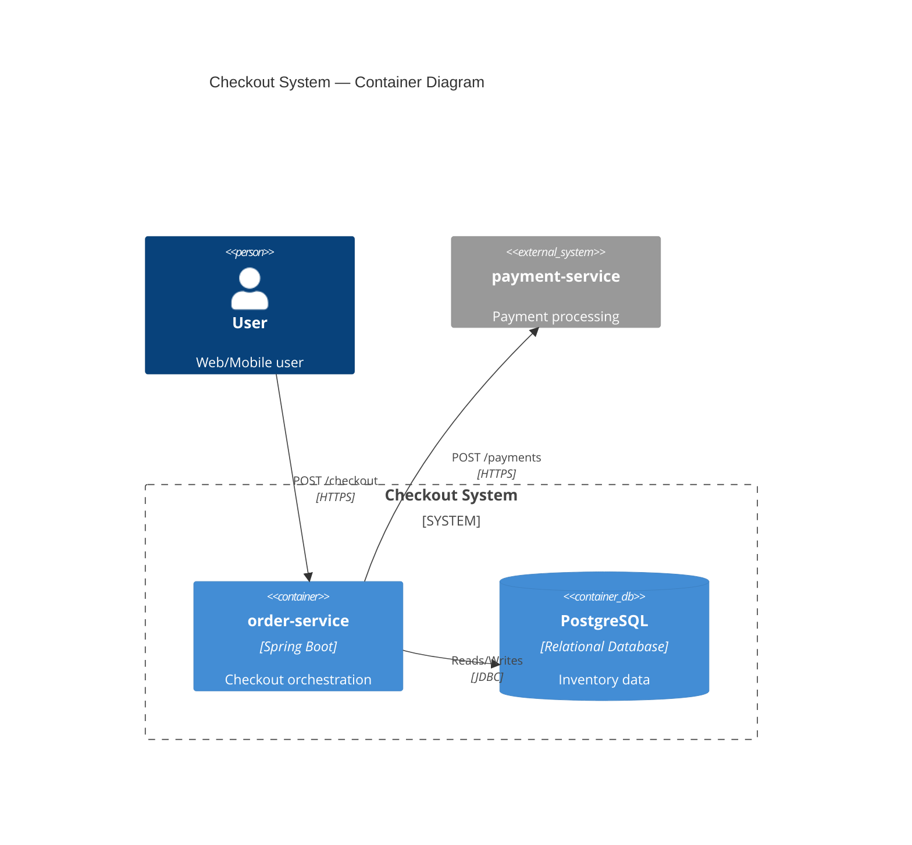

# C4 Model Conventions

Mermaid has native C4 diagram types (`C4Context`, `C4Container`, `C4Component`) with C4-PlantUML-compatible syntax. Start the diagram with the type name and an optional `title`; no `@startuml`/`@enduml` needed.

## C2 Container Diagram — `C4Container`

**Elements**:
- `Person(alias, "Label", "Descr")` — users/actors (external left)
- `Container(alias, "Label", "Tech", "Descr")` — applications/services
- `ContainerDb(alias, "Label", "Tech", "Descr")` — databases (below services)
- `ContainerQueue(alias, "Label", "Tech", "Descr")` — message queues
- `System_Ext(alias, "Label", "Descr")` — external systems (external right)
- `System_Boundary(alias, "Label") { ... }` — group related containers
- `Rel(src, tgt, "Label", "Tech")` — connections

**Connection labels**: Include protocol and endpoint — `Rel(a, b, "POST /payments", "HTTPS")`, `Rel(svc, broker, "publishes OrderConfirmed", "Kafka")`, `Rel(svc, db, "Reads/Writes", "JDBC")`.

**Layout**: External actors left, external systems right, databases below services, message brokers between. Adjust density with `UpdateLayoutConfig($c4ShapeInRow="4", $c4BoundaryInRow="2")`.

## C3 Component Diagram — `C4Component`

**Elements**: `Container_Boundary(alias, "Label") { ... }` (wraps internal components), `Component(alias, "Label", "Tech", "Descr")` (internal components), `ComponentDb(alias, "Label", "Tech", "Descr")` (repositories).

**Layering**: Controllers/listeners (outer ring) → Services/orchestrators (middle) → Domain/repositories (inner). Mark external dependencies with the `_Ext` suffix (`Container_Ext`, `System_Ext`) placed outside the boundary.

**Connection labels**: Same as C2 — include protocol and endpoint.

## Example snippet (`C4Container`)

