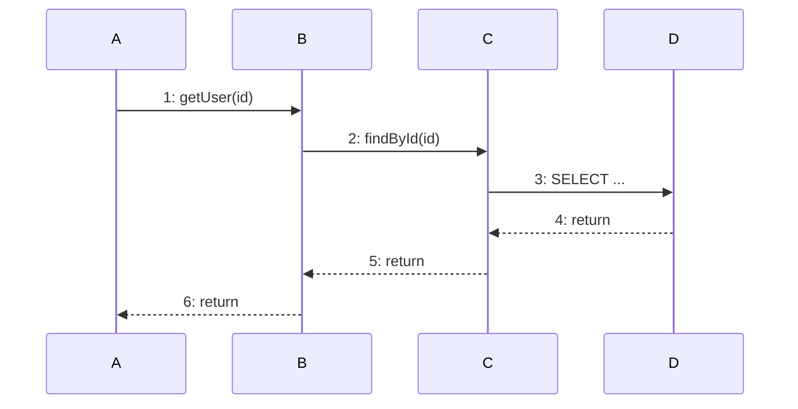

# Sequence Diagram Conventions

Use Mermaid `sequenceDiagram` syntax.

## Mermaid Quick Reference

| Pattern | Syntax |
|---|---|
| Participants | `actor "Name"`, `participant "Name"`, `database "Name"` |
| Sync call | `A->>B: N: methodName(params)` (solid arrow) |
| Async/event | `A-->>B: N: eventName(data)` (dashed arrow) |
| Return | `A-->>B: N: return value` (dashed arrow) |
| Activation | `activate A` / `deactivate A` |
| Conditional | `alt / else / end` |
| Loop | `loop N times / end` |
| Parallel | `par / and / end` |
| Note | `Note over A,B: text` |

## Message Numbering

Number messages sequentially for call-stack cross-referencing. Indentation in labels reflects call depth:

Return messages get their own numbers. Frame numbers in call stack traces must match these numbers.

## Participant Naming

Use `participant Alias as repo-name ComponentName` to show both the repo/container and the component on the lifeline.
