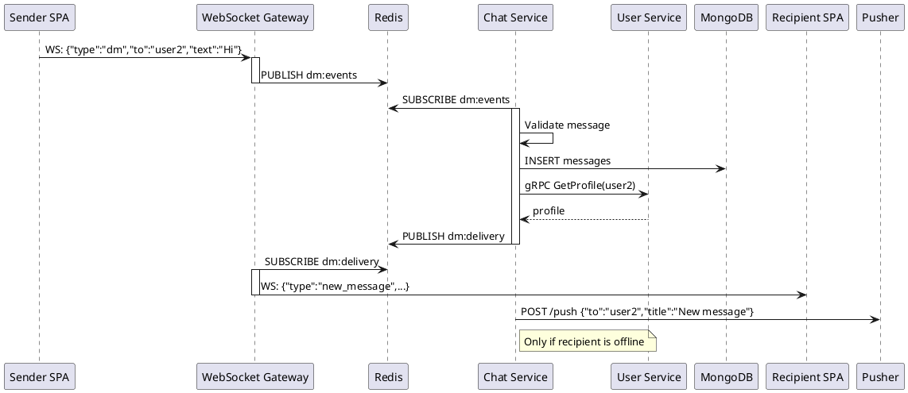
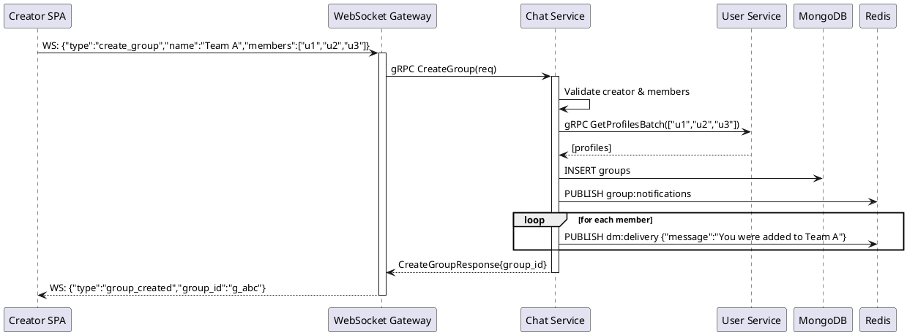
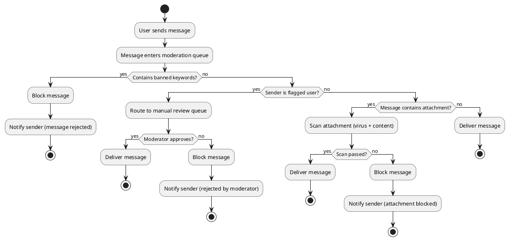
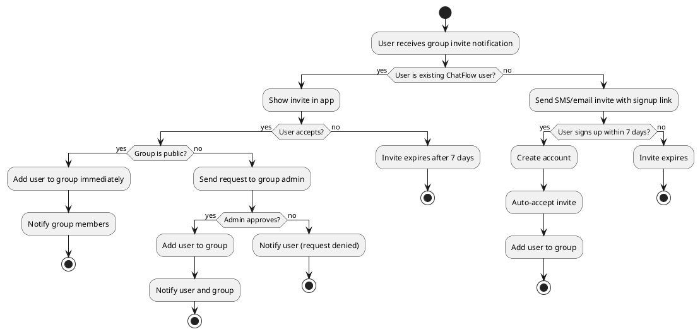

# Example: C4, Sequence, and Flowchart Diagrams Focus

**Scenario**: A user already has the business context documented and only needs help producing C4 topology diagrams, sequence diagrams, and flowcharts for a real-time chat platform called "ChatFlow". The user has strong opinions about the architecture and wants to iterate on the diagrams.

**Applies**: `draw-c4-topology` and `draw-interaction-diagrams` — demonstrates diagram-focused, iterative refinement workflow covering both sequence diagrams (for runtime message flows) and flowcharts (for process logic and decision branches).

---

## Input (User's Initial Prompt)

> We're building ChatFlow, a real-time messaging platform. Here's what we have: a React SPA frontend, a WebSocket gateway, a Chat service, a User service, and we use Redis for pub/sub and MongoDB for message persistence. External: we integrate with Auth0 for SSO and S3 for file uploads. Users send messages via the gateway, which publishes to Redis. The Chat service subscribes to Redis, persists to MongoDB, and pushes back to the recipient through the gateway. I need C2 and C3 diagrams, plus sequence diagrams for: (1) sending a direct message, (2) creating a group chat. Please produce these.

---

## Capability 2: draw-c4-topology

**Since the user provided detailed architecture, the assistant skips most discovery questions and goes straight to diagramming...**

**Q1**: Do the Chat service and User service communicate directly, or only through the WebSocket gateway?

*User answers: Direct — Chat service calls User service via gRPC to get user profiles.*

**Q2**: Any other external systems besides Auth0 and S3?

*User answers: We also use Pusher for push notifications to mobile.*

**C2 Container Diagram output**:

```plantuml
@startuml ChatFlow C2
!include https://raw.githubusercontent.com/plantuml-stdlib/C4-PlantUML/master/C4_Container.puml

Person(user, "User", "Chat participant")

System_Boundary(chatflow, "ChatFlow") {
    Container(spa, "SPA", "React", "Single-page web app")
    Container(ws_gw, "WebSocket Gateway", "Go", "WS connections, auth, routing")
    Container(chat_svc, "Chat Service", "Go", "Message handling and group logic")
    Container(user_svc, "User Service", "Java", "User profiles and contacts")
    ContainerDb(redis_pubsub, "Redis", "Redis", "Pub/sub for real-time messages")
    ContainerDb(mongo, "MongoDB", "MongoDB", "Message persistence")
}

System_Ext(auth0, "Auth0", "SSO & Identity")
System_Ext(s3, "AWS S3", "File storage")
System_Ext(pusher, "Pusher", "Mobile push notifications")

Rel(user, spa, "HTTPS/WSS", "Uses")
Rel(spa, auth0, "OAuth2", "Authenticates")
Rel(spa, ws_gw, "WSS", "Real-time messaging")
Rel(ws_gw, redis_pubsub, "RESP", "Publishes messages")
Rel(chat_svc, redis_pubsub, "RESP", "Subscribes")
Rel(chat_svc, mongo, "MongoDB Driver", "Persists messages")
Rel(chat_svc, user_svc, "gRPC", "Gets user profiles")
Rel(chat_svc, pusher, "HTTPS", "Push notifications")
Rel(chat_svc, s3, "S3 API", "File uploads/downloads")

@enduml
```

> **C2 Explanation**: The React SPA authenticates via Auth0 and establishes a persistent WebSocket connection to the Gateway. Messages flow: SPA → Gateway (WSS) → Redis (pub) → Chat Service (sub) → MongoDB (persist) → Redis (pub back) → Gateway → recipient SPA. The Chat Service calls User Service via gRPC for profiles and Pusher for mobile push.

[...user confirms...]

**C3 Component Diagram: Chat Service**:

```plantuml
@startuml ChatFlow ChatService C3
!include https://raw.githubusercontent.com/plantuml-stdlib/C4-PlantUML/master/C4_Component.puml

Container_Boundary(chat_svc, "Chat Service") {
    Component(msg_router, "Message Router", "Go goroutine", "Routes incoming messages by type")
    Component(dm_handler, "DM Handler", "Go goroutine", "Handles direct messages")
    Component(group_handler, "Group Handler", "Go goroutine", "Handles group chat logic")
    Component(persistence, "Persistence Layer", "Repository", "MongoDB CRUD operations")
    Component(notifier, "Notifier", "Adapter", "Pusher + WS push")
    Component(profile_client, "Profile Client", "gRPC Client", "User service calls")
    Component(s3_client, "S3 Client", "Adapter", "File operations")
}

Rel(msg_router, dm_handler, "Go channel", "DM messages")
Rel(msg_router, group_handler, "Go channel", "Group messages")
Rel(dm_handler, persistence, "func call", "save/load")
Rel(group_handler, persistence, "func call", "save/load")
Rel(dm_handler, profile_client, "gRPC call")
Rel(group_handler, notifier, "func call")
Rel(dm_handler, notifier, "func call")
Rel(dm_handler, s3_client, "func call")

@enduml
```

> **C3 Explanation**: The Chat Service uses goroutines with Go channels for concurrency. The Message Router fans out messages to DM Handler or Group Handler based on type. Both handlers use the Persistence Layer for MongoDB and the Notifier for push delivery. The DM Handler also calls the Profile Client (gRPC to User Service) and S3 Client for file attachments.

---

## Capability 3: draw-interaction-diagrams

**Based on the diagram-selection-guide, the assistant determines:**
- **Send DM flow** → Sequence diagram (runtime message passing between participants)
- **Create group chat flow** → Sequence diagram (runtime message passing between participants)
- **Message moderation workflow** → Flowchart (decision logic with branching)
- **Group chat invite acceptance flow** → Flowchart (decision logic with multiple branches)

### Direct Message Flow (Sequence Diagram)



> **DM Flow**: Sender sends via WS to Gateway → published to Redis `dm:events` → Chat Service subscribes, validates, persists to MongoDB, fetches recipient profile from User Service, publishes to `dm:delivery` → Gateway pushes to recipient's WS connection. If recipient is offline, Chat Service falls back to Pusher for mobile push notification.

**Group Chat Creation Flow**:



> **Group Creation Flow**: Creator sends request via WS → Gateway forwards via gRPC to Chat Service → Chat Service validates, fetches member profiles in batch from User Service, persists group to MongoDB, publishes notifications to each member, and returns group_id to creator.

### Message Moderation Workflow (Flowchart)

**The assistant recognizes this as decision logic with branching — a flowchart is the right choice.**



> **Moderation Flowchart**: Every message goes through a multi-stage moderation pipeline. First, a banned-keyword check blocks obvious violations. Then, flagged users are routed to manual review. Messages with attachments undergo virus and content scanning. Only messages that pass all checks are delivered. Each rejection path includes a user notification.

### Group Chat Invite Acceptance Flow (Flowchart)

**The assistant recognizes this as a business workflow with multiple decision points — flowchart is appropriate.**



> **Group Invite Flowchart**: The invite flow handles two distinct user types (existing vs. new) and two group types (public vs. private). Existing users accepting a public group invite are added immediately. Private groups require admin approval. Non-users are directed to sign up first, after which the invite is auto-accepted. All invite links expire after 7 days.

