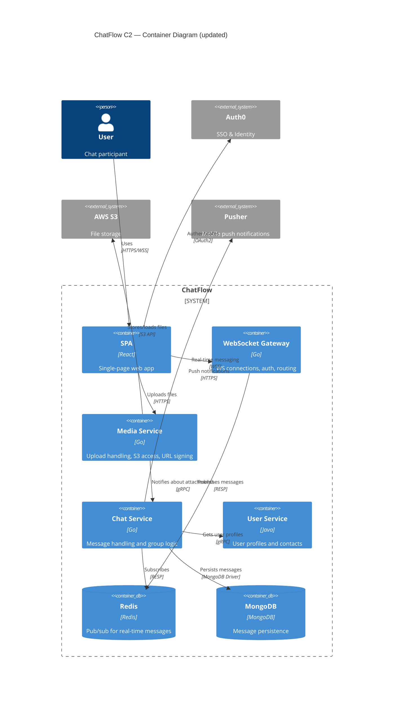

# Example: Keeping Solution Diagrams Current After Mid-Session Changes

**Scenario**: While documenting a solution for a real-time messaging platform, the user corrects the confirmed topology (a new Media Service container is added and file uploads move to it) and then reveals a new moderation webhook flow. This example shows how **sync-diagrams** updates the affected C2 container diagram and Send DM sequence diagram, and adds a new sequence diagram for the newly revealed context, so the document's visual record never goes stale.

**Applies**: `sync-diagrams` — triggered whenever the user corrects or revises previously confirmed content, or new findings emerge mid-session. It runs on top of whatever capability handled the change (here **draw-c4-topology** and **draw-interaction-diagrams**), not as part of the linear documentation sequence.

---

## Starting state (already confirmed)

- **Solution**: ChatFlow real-time messaging platform.
- **Confirmed C2 topology**: SPA, WebSocket Gateway, Chat Service, User Service, Redis, MongoDB, Auth0, S3, Pusher.
- **Confirmed flow**: Send DM sequence diagram (SPA → Gateway → Redis → Chat Service → MongoDB → User Service → Recipient).
- **Confirmed sections**: Business context, C2/C3 diagrams, interaction details.

**Diagrams already in the document**:
1. C2 container diagram
2. C3 component diagram (Chat Service)
3. Send DM sequence diagram

---

## Correction 1: New Media Service container

**User input**:
> Correction to the topology: file uploads don't go through the Chat Service — we have a dedicated Media Service that handles uploads to S3 and returns URLs. Please update the diagrams.

**Agent response (applies draw-c4-topology + sync-diagrams)**:
> Noted — adding a Media Service container and rerouting file uploads away from the Chat Service. Let me update the affected diagrams.

**Updated C2 container diagram**:
> Updated: added the Media Service container; the file-upload relationship now flows SPA → Media Service → S3 instead of through the Chat Service.



**Updated C3 component diagram (Chat Service)**:
> Updated: removed the S3 Client component from the Chat Service; file operations now belong to the Media Service. A C3 diagram for the Media Service can be added on request.

**Updated Send DM sequence diagram**:
> Updated: file-upload steps now go through the Media Service and return a signed URL to the sender before the message is sent.

```mermaid
sequenceDiagram
    actor Sender as "Sender SPA"
    participant Media as "Media Service"
    participant GW as "WebSocket Gateway"
    database Redis
    participant Chat as "Chat Service"
    participant User as "User Service"
    database Mongo as MongoDB
    actor Recipient as "Recipient SPA"

    Sender->>Media: POST /upload
    activate Media
    Media->>Media: Sign upload URL
    Media->>Media: Stream to S3
    Media-->>Sender: signed_url
    deactivate Media

    Sender->>GW: WS: {"type":"dm","to":"user2","text":"Hi","file":"signed_url"}
    activate GW
    GW->>Redis: PUBLISH dm:events
    deactivate GW

    Chat->>Redis: SUBSCRIBE dm:events
    activate Chat
    Chat->>Chat: Validate message
    Chat->>Mongo: INSERT messages
    Chat->>User: gRPC GetProfile(user2)
    User-->>Chat: profile
    Chat->>Redis: PUBLISH dm:delivery
    deactivate Chat

    GW->>Redis: SUBSCRIBE dm:delivery
    activate GW
    GW->>Recipient: WS: {"type":"new_message",...}
    deactivate GW
```

---

## New finding: moderation webhook

**User input**:
> One more thing — the moderation service (external) calls our Chat Service via webhook when a message is flagged. Should we show that flow?

**Agent response (applies sync-diagrams — new context, no existing diagram covers it)**:
> This is new context not covered by the existing diagrams, so I'll add a new sequence diagram for it:

```mermaid
sequenceDiagram
    participant Mod as "Moderation Service"
    participant Chat as "Chat Service"
    database Mongo as MongoDB
    participant GW as "WebSocket Gateway"
    actor Recipient as "Recipient SPA"

    Mod->>Chat: POST /webhooks/moderation {"message_id":"m_1","verdict":"flagged"}
    activate Chat
    Chat->>Chat: Validate webhook signature
    Chat->>Mongo: UPDATE messages SET status="flagged"
    Chat->>GW: WS publish dm:moderated
    GW->>Recipient: WS: {"type":"message_moderated",...}
    Chat-->>Mod: 200 OK
    deactivate Chat
```

> This moderation webhook sequence diagram will be added to the Interaction Details section.

---

## Final check (sync-diagrams step 5)

**Agent output**:
> Cross-check of the full diagram set:
> - C2 container diagram — updated with Media Service ✅
> - C3 component diagram — updated, S3 client removed ✅
> - Send DM sequence diagram — updated with Media Service upload steps ✅
> - Moderation webhook sequence diagram — new diagram covering the newly revealed context ✅
>
> Every confirmed architectural fact is now represented in at least one diagram, and no diagram contradicts the latest state.
