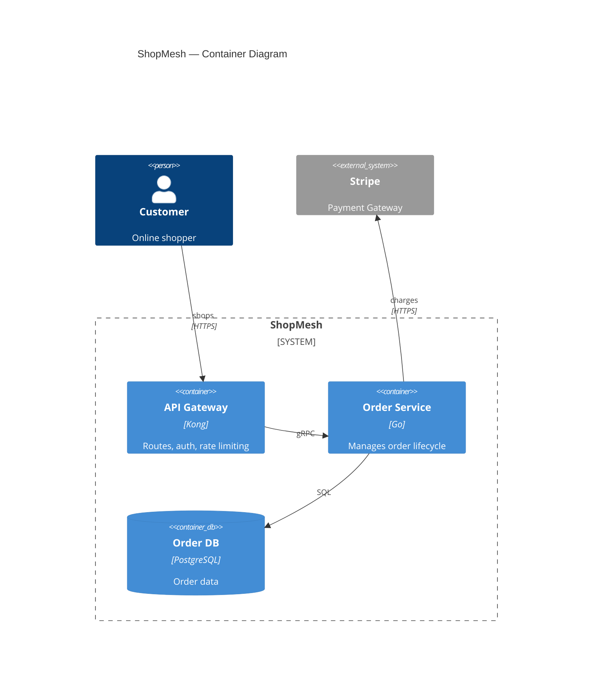
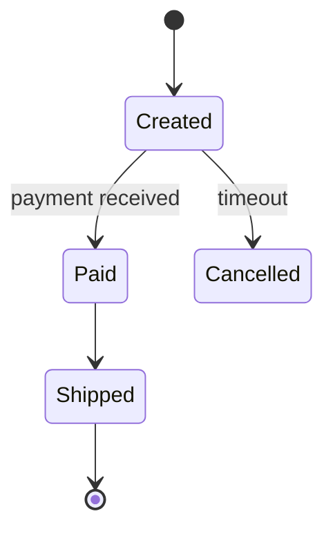

# Mermaid Standards

## General

- Draw all diagrams with Mermaid inside a fenced code block with `mermaid` language tag.
- Keep diagrams focused and readable — no more than 8–12 elements per diagram.
- Every diagram must include a brief caption/explanation in the document.
- Support both English and Chinese labels based on user preference.
- Always provide complete, renderable Mermaid code.

## C4 Diagrams

Mermaid has native C4 support: `C4Context` (system context), `C4Container` (C2 container), `C4Component` (C3 component), `C4Dynamic`, and `C4Deployment`. Syntax is C4-PlantUML-compatible — start the diagram with the type name (no `@startuml`/`@enduml`) and add an optional `title`:

| C4 element | Mermaid syntax | Example |
|---|---|---|
| Person / actor | `Person(alias, "Label", "Descr")` | `Person(customer, "Customer", "Places orders")` |
| External person | `Person_Ext(alias, "Label", "Descr")` | `Person_Ext(c, "Caller", "Calls APIs")` |
| System | `System(alias, "Label", "Descr")` | `System(oms, "Order Service", "Handles orders")` |
| External system | `System_Ext(alias, "Label", "Descr")` | `System_Ext(ps, "Stripe", "Charges payments")` |
| System database | `SystemDb(alias, "Label", "Descr")` | `SystemDb(db, "Order DB", "Stores orders")` |
| System queue | `SystemQueue(alias, "Label", "Descr")` | `SystemQueue(q, "Events", "Message queue")` |
| Container | `Container(alias, "Label", "Tech", "Descr")` | `Container(api, "API Gateway", "Go", "Ingests orders")` |
| Container DB | `ContainerDb(alias, "Label", "Tech", "Descr")` | `ContainerDb(db, "Order DB", "PostgreSQL", "Stores orders")` |
| Component | `Component(alias, "Label", "Tech", "Descr")` | `Component(oc, "Order Controller", "REST", "Ingests orders")` |
| System boundary | `System_Boundary(alias, "Label") { ... }` | `System_Boundary(oms, "Order Service") { ... }` |
| Container boundary | `Container_Boundary(alias, "Label") { ... }` | `Container_Boundary(api, "API Gateway") { ... }` |
| Relationship | `Rel(from, to, "Label", "Tech")` | `Rel(customer, oms, "POST /orders", "HTTPS")` |
| Bidirectional | `BiRel(from, to, "Label", "Tech")` | `BiRel(a, b, "syncs")` |

Mark external elements with the `_Ext` suffix (`System_Ext`, `Container_Ext`, `Component_Ext`) instead of a dashed style.

**Connection labels**: Include protocol and endpoint — `Rel(a, b, "POST /payments", "HTTPS")`, `Rel(svc, broker, "publishes OrderConfirmed", "Kafka")`, `Rel(svc, db, "Reads/Writes", "JDBC")`.

**Layout**: adjust shape/boundary density with `UpdateLayoutConfig($c4ShapeInRow="4", $c4BoundaryInRow="2")`; fine-tune with `UpdateRelStyle(from, to, $offsetX=..., $offsetY=...)`. C4 is experimental in Mermaid — stick to the element types above and re-check syntax if rendering fails.

**Example C2 (`C4Container`)**:

## Sequence Diagrams

Use `sequenceDiagram` syntax:
- `actor Name` — external actor
- `participant Name as Alias` — component/service lifeline
- `database Name as Alias` — data store lifeline
- `->>` — synchronous message
- `-->>` — asynchronous / return message
- `activate` / `deactivate` — activation bars
- `Note left of A` / `Note right of A` / `Note over A,B` — annotations
- `alt` / `else` / `end` — conditional branches
- `loop` / `end` — loops
- `par` / `and` / `end` — parallel branches
- Use ` ` for line breaks inside message labels.

## Flowcharts

Use `flowchart` (`TD` or `LR`):
- `([Start])` / `([End])` — start and stop nodes (stadium shape)
- `[Process]` — process step (rectangle)
- `{Decision?}` — decision node (diamond)
- `-->|yes|` / `-->|no|` — labeled branch arrows
- `subgraph` — swimlane/grouping by owner
- `style` — color a node (optional)

**Flowchart best practices**:
- Always start and end with stadium nodes.
- Use short, imperative labels for process steps (e.g., `Validate order`, not `The order is validated by the system`).
- Label every branch of a decision node.
- For state machines, use `stateDiagram-v2` instead of a flowchart if the focus is on states rather than process steps.

**Example flowchart**:

## State Diagrams

Use `stateDiagram-v2` for pure state/status lifecycles with no decision branching:

## Updating Existing Diagrams

Diagrams are living artifacts of the solution document: sync them whenever the user confirms a new finding or correction, so the visual record never goes stale.

- **Update in place when the change affects an existing diagram**: keep the same diagram identity (title, aliases, structure) and change only what is affected. State the delta in one line before the updated code block (e.g., "Updated: added the Media Service container and rerouted file uploads to it").
- **Add a new diagram when the context is genuinely new**: a new flow, zoom level, or edge case no existing diagram covers. Give it a distinct title; do not overload an existing diagram with extra branches.
- **Preserve identity**: when updating, keep the same aliases and labels so readers can diff old vs. new.
- **Keep the set consistent**: after every change, each confirmed architectural fact appears in at least one diagram, and no diagram contradicts the latest confirmed state. Cross-check the whole set before proceeding.
- **Never leave stale visuals**: if a diagram depicts an obsolete state, update or replace it — do not leave both old and new versions in the document.
