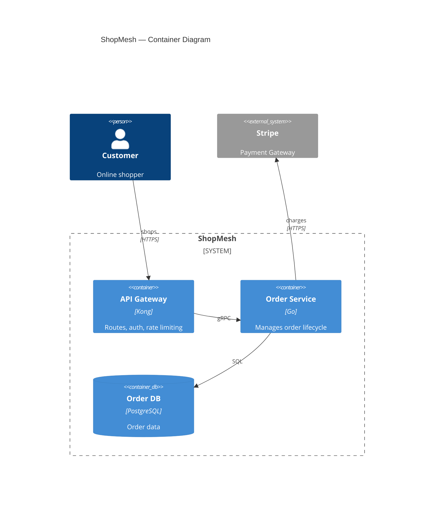
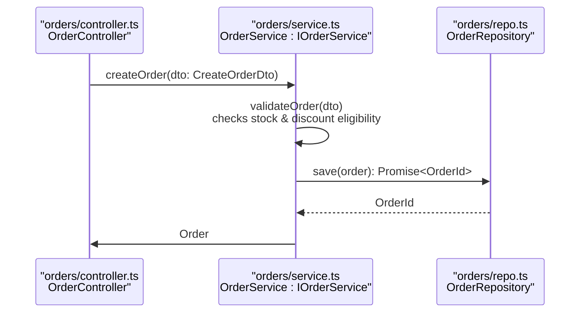
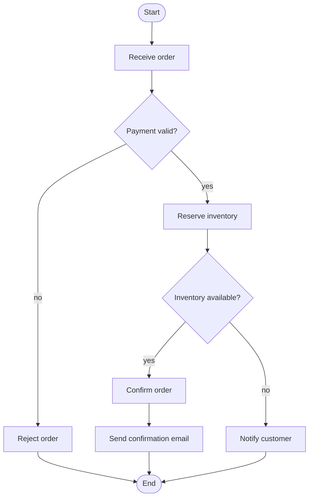
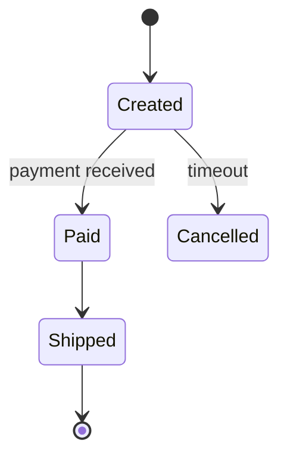

# Mermaid Standards

## General

- Draw all diagrams with Mermaid inside a fenced code block with `mermaid` language tag.
- Keep diagrams focused and readable — no more than 8–12 elements per diagram.
- Every diagram must include a brief caption/explanation in the document.
- Support both English and Chinese labels based on user preference.
- Always provide complete, renderable Mermaid code.

## Writing Robust Labels

Most broken diagrams come from special characters in labels — a semicolon (`;`) in a description is the #1 cause. Mermaid parses `; " # ( ) [ ] { } |` as **syntax, not text**, so they can end a statement or change the shape mid-label.

In order of preference:
1. **Reword** — never put risky characters in a label. Replace `;` with `,` / `，` / `·` (e.g. "handles orders; manages refunds" → "handles orders, manages refunds"); drop or reword `()`; avoid `#` and `"`. Rewording is version-proof — no escaping, no parser quirks.
2. **Quote** — when real syntax is required (API paths, method calls), wrap the text in quotes: `A["POST /orders"]`, `-->|"creates order"|`, `Rel(a, b, "charges", "HTTPS")`. Never emit unquoted text containing syntax characters.
3. **Escape** — only inside a quoted string, use Mermaid HTML entities: `#quot;` for `"`, `#35;` for `#`, `#40;` / `#41;` for `(` / `)`, `#59;` for `;`.
4. **Line breaks** — use `<br/>` in labels; a raw newline inside a label breaks the statement.
5. **Self-check** — before output, scan every label for `; " # ( ) [ ] { } |`; reword or escape any hit. If a label still feels risky, shorten it and move detail to the caption.

C4: `;` in C4 descriptions (`Person(c, "Customer", "Places orders; queries")`) is a common breaker — always reword the description instead of escaping.

## C4 Diagrams

Mermaid has native C4 support: `C4Context` (system context), `C4Container` (C2 container), `C4Component` (C3 component), `C4Dynamic`, and `C4Deployment`. Syntax is C4-PlantUML-compatible — start the diagram with the type name (no `@startuml`/`@enduml`) and add an optional `title`:

| C4 element | Mermaid syntax | Example |
|---|---|---|
| Person / actor | `Person(alias, "Label", "Descr")` | `Person(customer, "Customer", "Places orders")` |
| External person | `Person_Ext(alias, "Label", "Descr")` | `Person_Ext(c, "Caller", "Calls APIs")` |
| System | `System(alias, "Label", "Descr")` | `System(oms, "Order Service", "Handles orders")` |
| External system | `System_Ext(alias, "Label", "Descr")` | `System_Ext(ps, "Stripe", "Charges payments")` |
| System database | `SystemDb(alias, "Label", "Descr")` | `SystemDb(db, "Order DB", "Stores orders")` |
| System queue | `SystemQueue(alias, "Label", "Descr")` | `SystemQueue(q, "Events", "Message queue")` |
| Container | `Container(alias, "Label", "Tech", "Descr")` | `Container(api, "API Gateway", "Go", "Ingests orders")` |
| Container DB | `ContainerDb(alias, "Label", "Tech", "Descr")` | `ContainerDb(db, "Order DB", "PostgreSQL", "Stores orders")` |
| Component | `Component(alias, "Label", "Tech", "Descr")` | `Component(oc, "Order Controller", "REST", "Ingests orders")` |
| System boundary | `System_Boundary(alias, "Label") { ... }` | `System_Boundary(oms, "Order Service") { ... }` |
| Container boundary | `Container_Boundary(alias, "Label") { ... }` | `Container_Boundary(api, "API Gateway") { ... }` |
| Relationship | `Rel(from, to, "Label", "Tech")` | `Rel(customer, oms, "POST /orders", "HTTPS")` |
| Bidirectional | `BiRel(from, to, "Label", "Tech")` | `BiRel(a, b, "syncs")` |

Mark external elements with the `_Ext` suffix (`System_Ext`, `Container_Ext`, `Component_Ext`) instead of a dashed style.

**Connection labels**: Include protocol and endpoint — `Rel(a, b, "POST /payments", "HTTPS")`, `Rel(svc, broker, "publishes OrderConfirmed", "Kafka")`, `Rel(svc, db, "Reads/Writes", "JDBC")`.

**Layout**: adjust shape/boundary density with `UpdateLayoutConfig($c4ShapeInRow="4", $c4BoundaryInRow="2")`; fine-tune with `UpdateRelStyle(from, to, $offsetX=..., $offsetY=...)`. C4 is experimental in Mermaid — stick to the element types above and re-check syntax if rendering fails.

**Example C2 (`C4Container`)**:


## Sequence Diagrams

Use `sequenceDiagram` syntax for runtime message flows. Every sequence diagram follows the **sequence diagram contract**: one zoom level, traceable participants, contract-accurate messages, and a strict noise budget.

### Syntax quick reference

- `actor Name` — external actor (human or external system)
- `participant Name as Alias` — service / component / class lifeline
- `database Name as Alias` — data store lifeline
- `->>` — synchronous request (solid arrow)
- `-)` — asynchronous / fire-and-forget message (open arrow)
- `-->>` — return / reply **only** (dashed arrow)
- `activate` / `deactivate` — activation bars (use sparingly)
- `Note left of A` / `Note right of A` / `Note over A,B` — annotations
- `alt` / `else` / `end` — conditional branches
- `loop` / `end` — loops
- `par` / `and` / `end` — parallel branches
- `<br/>` — line break inside labels
- `%%` — comment; use it to declare the zoom level

### Zoom level (hard rule)

Every sequence diagram operates at exactly **one** zoom level. Never mix levels in a single diagram — a whole service must not share a diagram with a single class. If a flow needs two levels, draw two diagrams.

| Level | Lifelines are | Messages are | Use when |
|---|---|---|---|
| Container (cross-system) | services / systems | API endpoints, events, protocols | runtime message flow between systems |
| Component (cross-module) | modules / interfaces | method calls | flow across modules or interfaces |
| Code (cross-file / class) | files / classes | method signatures | flow across files or classes |

Declare the level in a `%%` comment and in the caption, e.g. `%% Level: code — cross-file / class`.

### Participant identity

A lifeline label encodes its identity path so the reader always knows **which system / file / class** it is:

| Level | Participant declaration |
|---|---|
| Cross-system | `participant OMS as "Order Service"` |
| Cross-module | `participant OC as "orders/controller.ts<br/>OrderController"` |
| Cross-file / class | `participant OR as "orders/repo.ts<br/>OrderRepository : IOrderRepository"` |

Rules:
- **Always include the file path** at component or code level — it is the easiest way to locate the element.
- Show the interface after the class (`: IOrderService`) when the role is defined by one.
- Group participants by ownership with an **alias prefix per system** (e.g. `OMS_Controller`, `OMS_Repo`, `PS_Gateway`) — Mermaid sequence diagrams have no boundary boxes, so the alias prefix carries the grouping.
- Use participant types semantically: `actor` = human/external, `participant` = service/class, `database` = store.

### Message labels are the contract

A message label carries the **real API / event / method**, never prose:
- Cross-system: `POST /orders`, `gRPC ReserveStock`, `publish OrderCreated (Kafka: orders)`
- Code level: `createOrder(dto: CreateOrderDto): Promise<Order>`

Arrow semantics:
- `->>` — synchronous request
- `-)` — asynchronous / fire-and-forget message
- `-->>` — return / reply only — do not use it for async messages

### Events and self-calls carry a short explanation

For **async/event messages** and **self-calls**, append a short explanation of the effect after the actual call, separated by `<br/>` — the event or method name alone does not reveal what happens:

```
OrderService->>OrderService: validateOrder(dto)<br/>checks stock & discount eligibility
OrderService->>Broker: publish OrderCreated<br/>notifies downstream services
```

Self-calls:
- Show at most **2 per lifeline**, and only when the internal step is part of the story.
- If the internal logic is larger, summarize with `Note over X: ...` or extract a flowchart — sequence diagrams stay focused on cross-boundary interactions.

### Noise budget

- **4–6 lifelines maximum**. More participants → split the flow into separate diagrams.
- **One diagram = one flow**: happy path; put error/edge paths in a separate diagram or a single `alt` block.
- Show returns **only** when they carry data the next step needs — no `return → return → return` chains.
- Skip `activate` / `deactivate` unless call nesting matters.
- More than 2 structural blocks (`alt` / `loop` / `par`) → extract a flowchart.

### Example — code level (cross-file / class)



### Example — container level (cross-system)

```mermaid
sequenceDiagram
    %% Level: container — cross-system flow
    actor Customer
    participant OMS as "Order Service"
    participant PS as "Payment Gateway (external)"
    database DB as "Order DB"

    Customer->>OMS: POST /orders
    OMS->>PS: POST /v1/charges
    PS-->>OMS: 201 {chargeId}
    OMS->>DB: INSERT orders
    OMS-->>Customer: 201 {orderId}
```

## Flowcharts

Use `flowchart` (`TD` or `LR`):
- `([Start])` / `([End])` — start and stop nodes (stadium shape)
- `[Process]` — process step (rectangle)
- `{Decision?}` — decision node (diamond)
- `-->|yes|` / `-->|no|` — labeled branch arrows
- `subgraph` — swimlane/grouping by owner
- `style` — color a node (optional)

**Flowchart best practices**:
- Always start and end with stadium nodes.
- Use short, imperative labels for process steps (e.g., `Validate order`, not `The order is validated by the system`).
- Label every branch of a decision node.
- For state machines, use `stateDiagram-v2` instead of a flowchart if the focus is on states rather than process steps.

**Example flowchart**:


## State Diagrams

Use `stateDiagram-v2` for pure state/status lifecycles with no decision branching:



## Updating Existing Diagrams

Diagrams are living artifacts of the solution document: sync them whenever the user confirms a new finding or correction, so the visual record never goes stale.

- **Update in place when the change affects an existing diagram**: keep the same diagram identity (title, aliases, structure) and change only what is affected. State the delta in one line before the updated code block (e.g., "Updated: added the Media Service container and rerouted file uploads to it").
- **Add a new diagram when the context is genuinely new**: a new flow, zoom level, or edge case no existing diagram covers. Give it a distinct title; do not overload an existing diagram with extra branches.
- **Preserve identity**: when updating, keep the same aliases and labels so readers can diff old vs. new.
- **Keep the set consistent**: after every change, each confirmed architectural fact appears in at least one diagram, and no diagram contradicts the latest confirmed state. Cross-check the whole set before proceeding.
- **Never leave stale visuals**: if a diagram depicts an obsolete state, update or replace it — do not leave both old and new versions in the document.
