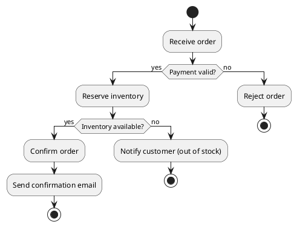

# PlantUML Standards

## General

- Use `@startuml` / `@enduml` blocks.
- Keep diagrams focused and readable — no more than 8–12 elements per diagram.
- Every diagram must include a brief caption/explanation in the document.
- Support both English and Chinese labels based on user preference.
- Always provide complete, renderable PlantUML code inside a fenced code block with `plantuml` language tag.

## C4 Diagrams

Prefer the C4-PlantUML standard library macros:
- `Person`, `System`, `System_Ext`, `Container`, `ContainerDb`, `Component`
- `Rel` for relationships
- `System_Boundary`, `Container_Boundary` for grouping

Include via: `!include https://raw.githubusercontent.com/plantuml-stdlib/C4-PlantUML/master/C4_Container.puml`

## Sequence Diagrams

Use standard PlantUML sequence syntax:
- `participant "Name" as Alias` — declare participants
- `->` — synchronous message
- `-->` — asynchronous/return message
- `activate` / `deactivate` — activation bars
- `note left of` / `note right of` / `note over` — annotations
- `alt` / `else` / `end` — conditional branches
- `loop` / `end` — loops
- `group` / `end` — grouped blocks
- `opt` / `end` — optional blocks

## Flowcharts

Use PlantUML activity diagram syntax (new syntax with `@startuml`):
- `start` / `stop` / `end` — start and stop nodes
- `:Label text;` — process step (rectangle)
- `if (Condition?) then (yes)` / `elseif (...) then (...)` / `else (no)` / `endif` — decision node (diamond)
- `->` — flow arrow
- `repeat` / `repeat while (Condition?)` — loop
- `split` / `split again` / `end split` — parallel branches
- `#color:Label;` — color a node
- `note right` / `note left` — annotations
- `partition "Name" { ... }` — swimlane/grouping
- `|Name|` — swimlane in the activity label (e.g., `|Service A|:Do something;`)

**Flowchart best practices**:
- Always start with `start` and end with `stop`.
- Use short, imperative labels for process steps (e.g., `:Validate order;` not `:The order is validated by the system;`).
- Label every branch of a decision node clearly (the `then` and `else` text is rendered on the arrows).
- For business workflows, consider using `partition` (swimlanes) to show ownership of each step.
- For state machines, use `state` diagram syntax instead of activity syntax if the focus is on states rather than process steps.

**Example flowchart**:

